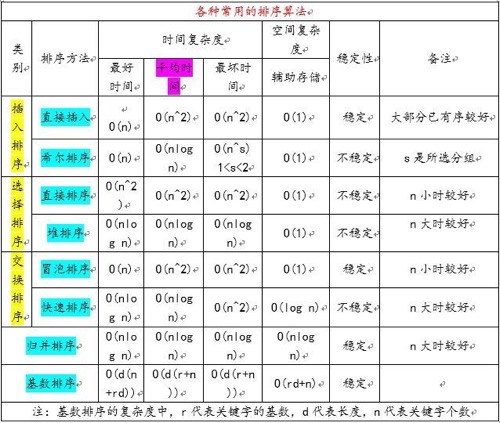

# 1.回溯

[回溯算法解题套路框架](https://labuladong.gitbook.io/algo/di-ling-zhang-bi-du-xi-lie/hui-su-suan-fa-xiang-jie-xiu-ding-ban)

**解决一个回溯问题，实际上就是一个决 策树的遍历过程**。你只需要思考 3 个问题:

- 1、路径:也就是已经做出的选择。

- 2、选择列表:也就是你当前可以做的选择。 

- 3、结束条件:也就是到达决策树底层，无法再做选择的条件。

代码方面，回溯算法的框架:

```java
result = []
def backtrack(路径, 选择列表): 
	if 满足结束条件:
	result.add(路径) 
  return
    
	for 选择 in 选择列表: 
		做选择
		backtrack(路径, 选择列表) 
    撤销选择
```

例子：46 全排列

​			51 N 皇后

​			22 括号生成


# 1.dynamic programming

## 1.1 DP 使用场景以及解题的主要步骤

1. 优化问题或者计数问题，比如求 maximum ，minimum

2. ==寻找递归式==（大问题化小问题）

3. 简单的递归写法时间复杂度过高（因为子问题重叠过的）
4. 优化（避免重复计算）
   - bottom up 小 --> 大
   - top down( with memoization)

# 2.递归

==递归有以下两个特点：==

1. 一个问题可以分解成具有**相同解决思路**的子问题，子子问题，换句话说这些问题都**能调用同一个函数**
2. 经过层层分解的子问题最后一定是有一个不能再分解的固定值的（即终止条件）,如果没有的话,就无穷无尽地分解子问题了，问题显然是无解的。

所以解递归题的关键在于我们首先需要根据以上递归的两个特点判断题目是否可以用递归来解。

递归代码最重要的两个特征：**结束条件**和**自我调用**

经过判断可以用递归后，接下来我们就来看看用递归解题的==基本套路（四步曲）==： 

1. 先定义一个函数，**明确这个函数的功能**，由于递归的特点是问题和子问题都会调用函数自身，所以这个函数的功能一旦确定了， 之后只要找寻问题与子问题的递归关系即可 
2. 接下来寻找问题与子问题间的关系（即**递推公式**），这样由于问题与子问题具有**相同解决思路**，只要子问题调用步骤 1 定义好的函数，问题即可解决。所谓的关系最好能用一个公式表示出来，比如 **f(n) = n \* f(n-1)** 这样，如果暂时无法得出明确的公式，用伪代码表示也是可以的, 发现递推关系后，要寻找最终不可再分解的子问题的解，即（临界条件），确保子问题不会无限分解下去。由于第一步我们已经定义了这个函数的功能，所以当问题拆分成子问题时，子问题可以调用步骤 1 定义的函数，符合递归的条件（**函数里调用自身**） 
3.  将第二步的递推公式用代码表示出来补充到步骤 1 定义的函数中 
4. 最后也是很关键的一步，根据问题与子问题的关系，推导出时间复杂度,如果发现递归时间复杂度不可接受，则需**转换思路对其进行改造**，看下是否有更靠谱的解法

Java 代码模板

```java
// Java
public void recur(int level, int param) { 
  // recursion terminator 
  if (level > MAX_LEVEL) { 
    // process result 
    return; 
  }
  // process logic in current level 
  process(level, param); 
  // drill down 
  recur( level: level + 1, newParam); 
  
  // reverse the current level status if needed
 
}
```


