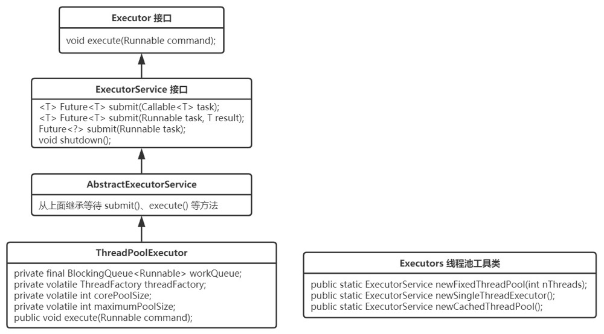

# 一、设计模式的分类

总体来说设计模式分为三大类：

创建型模式，共五种：工厂方法模式、抽象工厂模式、单例模式、建造者模式、原型模式。

结构型模式，共七种：适配器模式、装饰器模式、代理模式、外观模式、桥接模式、组合模式、享元模式。

行为型模式，共十一种：策略模式、模板方法模式、观察者模式、迭代子模式、责任链模式、命令模式、备忘录模式、状态模式、访问者模式、中介者模式、解释器模式。


# 二、设计模式的六大原则

### 总原则：开闭原则（Open Close Principle）

开闭原则就是说**对扩展开放，对修改关闭**。在程序需要进行拓展的时候，不能去修改原有的代码，而是要扩展原有代码，实现一个热插拔的效果。所以一句话概括就是：为了使程序的扩展性好，易于维护和升级。想要达到这样的效果，我们需要使用接口和抽象类等，后面的具体设计中我们会提到这点。

### 1、单一职责原则

不要存在多于一个导致类变更的原因，也就是说每个类应该实现单一的职责，如若不然，就应该把类拆分。


### 2、里氏替换原则（Liskov Substitution Principle）

里氏代换原则(Liskov Substitution Principle LSP)面向对象设计的基本原则之一。 里氏代换原则中说，任何基类可以出现的地方，子类一定可以出现。 LSP是继承复用的基石，只有当衍生类可以替换掉基类，软件单位的功能不受到影响时，基类才能真正被复用，而衍生类也能够在基类的基础上增加新的行为。里氏代换原则是对“开-闭”原则的补充。实现“开-闭”原则的关键步骤就是抽象化。而基类与子类的继承关系就是抽象化的具体实现，所以里氏代换原则是对实现抽象化的具体步骤的规范。

里氏替换原则中，子类对父类的方法尽量不要重写和重载。因为父类代表了定义好的结构，通过这个规范的接口与外界交互，子类不应该随便破坏它。

 

### 3、依赖倒转原则（Dependence Inversion Principle）

这个是开闭原则的基础，具体内容：面向接口编程，依赖于抽象而不依赖于具体。写代码时用到具体类时，不与具体类交互，而与具体类的上层接口交互。

 

### 4、接口隔离原则（Interface Segregation Principle）

这个原则的意思是：每个接口中不存在子类用不到却必须实现的方法，如果不然，就要将接口拆分。使用多个隔离的接口，比使用单个接口（多个接口方法集合到一个的接口）要好。

 

### 5、迪米特法则（最少知道原则）（Demeter Principle）

就是说：一个类对自己依赖的类知道的越少越好。也就是说无论被依赖的类多么复杂，都应该将逻辑封装在方法的内部，通过public方法提供给外部。这样当被依赖的类变化时，才能最小的影响该类。

最少知道原则的另一个表达方式是：只与直接的朋友通信。类之间只要有耦合关系，就叫朋友关系。耦合分为依赖、关联、聚合、组合等。我们称出现为成员变量、方法参数、方法返回值中的类为直接朋友。局部变量、临时变量则不是直接的朋友。我们要求陌生的类不要作为局部变量出现在类中。

 

### 6、合成复用原则（Composite Reuse Principle）

原则是尽量首先使用合成/聚合的方式，而不是使用继承。


# 三, 创建型模式，共五种

## 工厂方法模式

## 抽象工厂模式

## 单例模式

## 建造者模式

## 原型模式

# 四, 结构型模式，共七种

## 代理模式

java 动态代理

## 装饰器模式

- 什么情况下使用装饰设计模式

  当我们需要对一个类的功能进行改进、增强的时候

- 装饰模式的基本格式。

  - 含有被装饰类的引用
  - 通过构造函数传入被装饰类对象 
  - 和被装饰类含有同样的方法，其中调用被装饰类的方法，对其进行改进、增强 和被装饰类继承同一个类或实现同一个接口，可以当做被装饰类来使用

## 适配器模式

java.util.Arrays#asList() 可以把数组类型转换为 List 类型。

## 外观模式

## 桥接模式

## 组合模式

## 享元模式

# 五, 行为型模式，共十一种

## 模板方法模式 

**模式的定义与特点**

定义一个操作中的算法⻣架，而将算法的一些步骤延迟到子类中，使得子类可以不改变该算法结构的情况下重定义该算法的某些特定步骤。它是一种类行为型模式。


**该模式的主要优点如下**。

1. 它封装了不变部分，扩展可变部分。它把认为是不变部分的算法封装到父类中实现，而把可变部分算法由子类继承实现，便于子类继续扩展。
2. 它在父类中提取了公共的部分代码，便于代码复用。
3. 部分方法是由子类实现的，因此子类可以通过扩展方式增加相应的功能，符合开闭原则。

**该模式的主要缺点如下。**

1. 对每个不同的实现都需要定义一个子类，这会导致类的个数增加，系统更加庞大，设计也更加抽象。


**主要角色：**

- AbstractTemplate（抽象模板）：

  - 定义了一个或多个抽象操作，以便让子类实现。这些抽象操作叫做==基本操作==，它们是一个**顶级逻辑**的组成步骤。
  - 定义并实现了一个模板方法。这个**模板方法一般是一个具体方法，它给出了一个顶级逻辑的骨架**，而逻辑的组成步骤在相应的抽象操作中，推迟到子类实现。顶级逻辑也有可能调用一些具体方法。

- ConcreteTemplate(具体模板）：

  - 实现父类所定义的一个或多个抽象方法，它们是一个顶级逻辑的组成步骤。

  - 每一个抽象模板角色都可以有任意多个具体模板角色与之对应，而每一个具体模板角色都可以给出这些抽象方法（也就是顶级逻辑的组成步骤）的不同实现，从而使得顶级逻辑的实现各不相同。

    

**模板方法模式通常适用于以下场景**。

- 算法的整体步骤很固定，但其中个别部分易变时，这时候可以使用模板方法模式，将容易变的部分抽象出来，供子类实现。

- 当多个子类存在公共的行为时，可以将其提取出来并集中到一个公共父类中以避免代码重复。首先，要识别现有代码中的不同之处，并且将不同之处分离为新的操作。最后，用一个调用这些新的操作的模板方法来替换这些不同的代码。

  

**案例：**线程池



该组件中，Executor 和 ExecutorService接口 定义了线程池最核心的几个方法，提交任务submit ()、关闭线程池shutdown()。**抽象类 AbstractExecutorService 主要对公共行为 submit()系列方法进行了实现**，这些 ==submit()方法 的实现使用了 模板方法模式，其中调用的 execute()方法 是未实现的 来自 Executor接口 的方法。==

**Executor 和 ExecutorService接口**

```java
public interface Executor {

    /**
     * 在将来的某个时间执行给定的 Runnable。该 Runnable 可以在新线程、池线程或调用线程中执行。
     */
    void execute(Runnable command);
}

public interface ExecutorService extends Executor {

    /**
     * 优雅关闭，该关闭会继续执行完以前提交的任务，但不再接受新任务。
     */
    void shutdown();

    /**
     * 提交一个有返回值的任务，并返回该任务的 未来执行完成后的结果。
     * Future的 get()方法 将在成功完成后返回任务的结果。
     */
    <T> Future<T> submit(Callable<T> task);

    <T> Future<T> submit(Runnable task, T result);

    Future<?> submit(Runnable task);
}
```

**AbstractExecutorService 抽象类**

```java
/**
 * 该抽象类最主要的内容就是，实现了 ExecutorService 中的 submit()系列方法
 */
public abstract class AbstractExecutorService implements ExecutorService {

    /**
     * 顶级逻辑的骨架
     * 提交任务 进行执行，返回获取未来结果的 Future对象。
     * 这里使用了 “模板方法模式”，execute()方法来自 Executor接口，该抽象类中并未进行实现，
     * 而是交由子类具体实现。
     */
    public Future<?> submit(Runnable task) {
        if (task == null) throw new NullPointerException();
        RunnableFuture<Void> ftask = newTaskFor(task, null);
        execute(ftask);
        return ftask;
    }

    public <T> Future<T> submit(Runnable task, T result) {
        if (task == null) throw new NullPointerException();
        RunnableFuture<T> ftask = newTaskFor(task, result);
        execute(ftask);
        return ftask;
    }

    public <T> Future<T> submit(Callable<T> task) {
        if (task == null) throw new NullPointerException();
        RunnableFuture<T> ftask = newTaskFor(task);
        execute(ftask);
        return ftask;
    }
}
```

**ThreadPoolExecutor**

```java
public class ThreadPoolExecutor extends AbstractExecutorService {
	
	/** 实现父类的基本操作，执行 Runnable任务 */
    public void execute(Runnable command) {
        if (command == null)
            throw new NullPointerException();
        /*
         * 分三步进行：
         *
         * 1、如果运行的线程少于 corePoolSize，尝试开启一个新的线程；否则尝试进入工作队列
         *
         * 2. 如果工作队列没满，则进入工作队列；否则 判断是否超出最大线程数
         *
         * 3. 如果未超出最大线程数，则尝试开启一个新的线程；否则按饱和策略处理无法执行的任务
         */
        int c = ctl.get();
        if (workerCountOf(c) < corePoolSize) {
            if (addWorker(command, true))
                return;
            c = ctl.get();
        }
        if (isRunning(c) && workQueue.offer(command)) {
            int recheck = ctl.get();
            if (! isRunning(recheck) && remove(command))
                reject(command);
            else if (workerCountOf(recheck) == 0)
                addWorker(null, false);
        }
        else if (!addWorker(command, false))
            reject(command);
    }

    /**
     * 优雅关闭，在其中执行以前提交的任务，但不接受新任务。如果已关闭，则调用没有其他效果。
     */
    public void shutdown() {
        final ReentrantLock mainLock = this.mainLock;
        mainLock.lock();
        try {
            checkShutdownAccess();
            advanceRunState(SHUTDOWN);
            interruptIdleWorkers();
            onShutdown(); // hook for ScheduledThreadPoolExecutor
        } finally {
            mainLock.unlock();
        }
        tryTerminate();
    }
}
```

## 策略模式

## 观察者模式

## 迭代子模式

Collection 继承了 Iterable 接口，其中的 iterator() 方法能够产生一个 Iterator 对象，通过这个对象就可以迭代遍历 Collection 中的元素。

## 责任链模式

## 命令模式

## 备忘录模式

## 状态模式

## 访问者模式

## 中介者模式

## 解释器模式