# 1.下载安装

- Linux系统安装命令

  ```shell
  yum install git
  ```

- mac安装命令

  ```shell
  brew install git
  ```

- 在使用git进行版本管理之前，需要进行一个配置，这个配置是告诉git你的**用户名**以及你的**邮件账号**

  ```shell
  //配置基本信息
  [root@localhost ~]# git config --global user.name flymegoc
  [root@localhost ~]# git config --global user.email 343672271@qq.com
  //查看配置
  [root@localhost ~]# git config --list
  user.name=flymegoc
  user.email=343672271@qq.com
  ```

- 小技巧：忘记命令的具体写法时，可以进行Tab键进行提示。

  

# 2.Git 基本知识

- 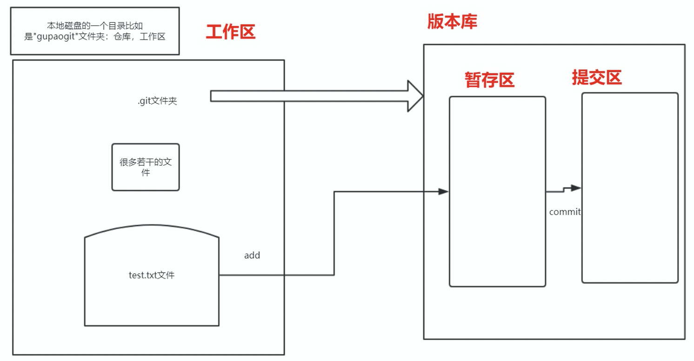


- 工作区就是你当前使用的一个目录，git 项目文件夹

- 版本库就是add以及commit之后的东西

- **使用git，步骤**：

  1. 下载与安装

  2. git config --global user.email/name 

  3. git init  对一个文件夹目录进行git初始化操作，这个初始化就是为了让git对这个文件夹中的文件进行版本管理。初始化完成之后，在当前目录下会有一个.git文件夹，这个**文件夹就是我们所说的版本库**。现在就可以用git对其下的文件进行一个版本的控制，就是可以对它进行一个版本的回退，回到当前等等。

  4. 接下来你的操作就是：无非在这个工作区或者仓库中创建文件，然后对文件进行一系列修改操作之类的。Git的要求是，你要让git帮你进行的版本的管理，必须先有一个文件夹，这个文件夹要被git进行初始化操作，这样才能进行一个git的版本管理。

     

# 3.git基础操作

- git status              git add         git commit

- 需求：在git工作区中新建一个文件，名称为“gupao.txt”。

  - **git status:**   表示查看git工作区（仓库）中的一个状态

    1. nothing to commit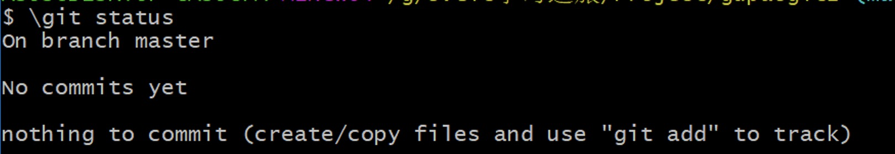

    2. 当你新建了一个文件之后

       Untracked files:  未被追踪的文件

       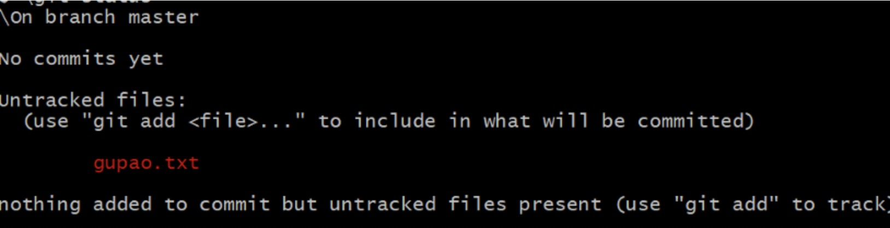

    3. 当我们进行git add gupao.txt之后

       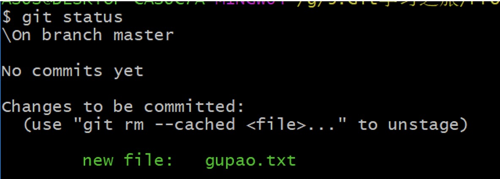

    4. 当我们进行git commit -m “gupao first”

       只有进入到提交区之后，我们的文件才能被git真正意义上管理起来

       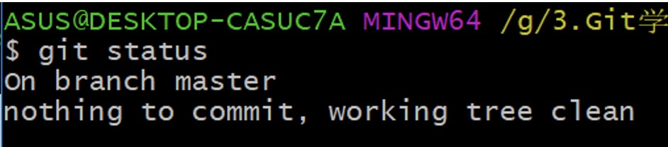

    5. 对应我们创建一个新文件的时候的状态

       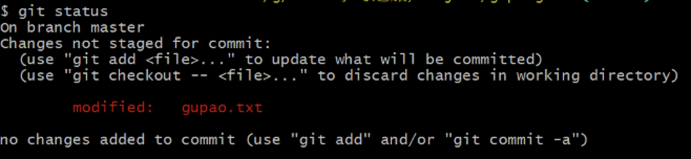

  - **git add:** 就是将工作区中的内容add到暂存区

  - **git commit**: 将暂存区的内容commit到提交区

- 要想让git对你的文件内容进行版本管理，必须经过两个步骤，第一个是git add，第二个是git commit。

  可以随时随地使用git status进行工作区中状态的查看。

  

# 4.git log和版本切换

- 大家都知道git可以进行版本控制与管理。如果你想要进行版本的切换的话，你需要知道的就是这个**commitid**，也就是说你要知道每一次提交的信息才可以。

- **Git log**  日志，也就是说查看git的日志信息

  - 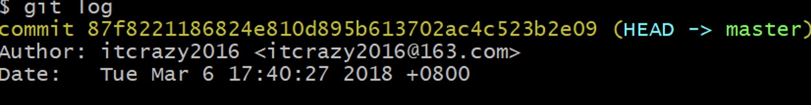

  - Commit

    Author :作者  就是当初配置  git global --- user.name

    Date：提交的日期

- **git log --pretty=oneline** ：只打印 commited id

- **git reset --hard commitid**（这个id可以根据git log查看日志信息去找到）：根据每次的commitid进行一个版本的切换。

- **git reset --hard HEAD^** ：直接回退到上一个版本  

-  **Git reset --hard HEAD^^**：  回退到上上个版本

  - 麻烦是，回退到之前的版本之后，最新的commitid没了。使用 git log 看不到回退之前的commitid了。
  - 重点是要找到最新的一个版本的commitid即可。  **git reflog**

  - 如果进行版本回退之后，发现commitid最新的没了，你可以使用git reflog进行**所有的commitid的查询**。


# 5.工作区暂存区和提交区

- 在工作区进行了修改，然后git status会有一个提示，告诉你下一步需要干嘛

  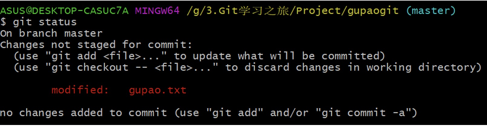

- 正常的思维，你会进行git add

- 后悔当前的操作，**git checkout -- gupao.txt**  会撤销工作区中的一个修改，也就是说你不需要进行git add操作了。

  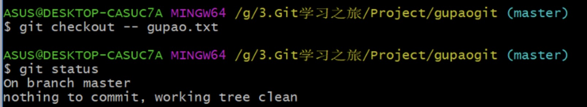

- 对于已经在暂存区的内容，使用git checkout -- gupao.txt 不可行了

  - **git reset HEAD gupao.txt**    **回到提交区中的最新版本**  
  - 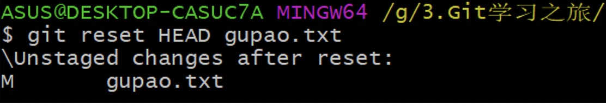
  - 接下来需要做的就是再次使用**git checkout -- gupao.txt，将修改拉回到工作区，把工作区的修改内容清空**


# 6.分支管理

## 6.1分支简介

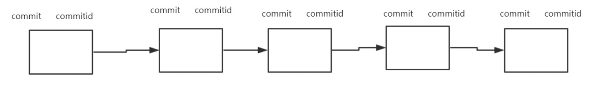

-  git reset --hard commitid

- HEAD ： 如果说内容已经add到暂存区，此时要想撤销的话，需要先回到最新的一个commitid上   HEAD  HEAD^  HEAD^^

- HEAD就表示当前**最新的版本的commitid**，也就是最新的指针指向

- Master分支是主分支，也是git为你默认创建的分支

  

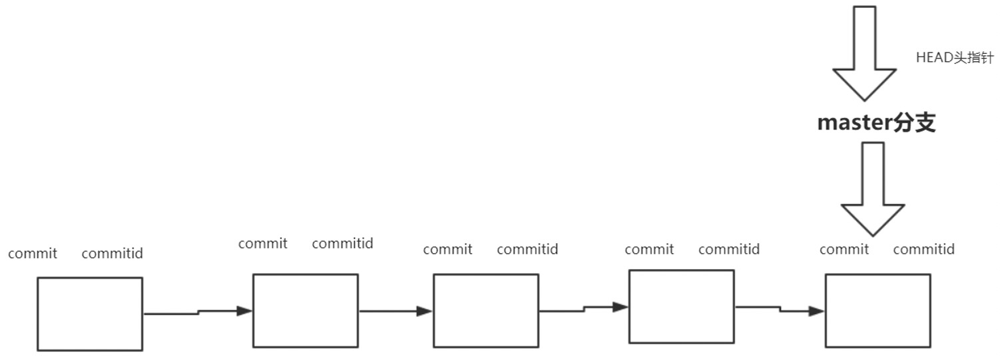

-  Master分支指向的是**最新的提交commitid**，**头指针**指向的是我们的**master分支**。

- 但是git的强大之处远不止如此，而是有一个多人协作开发的概念。不仅是一个单人开发进行版本控制，同时可以多人协作开发进行一个版本控制。 就是通过git的分支进行的。

  

## 6.2 分支详解

- 在主分支master上切出一个开发分支，比如叫”dev_wang” 

  **git checkout -b dev_wang**;   创建一个分支

  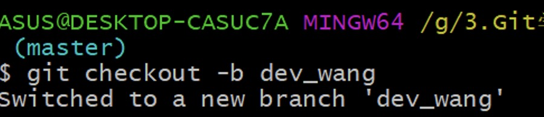

- **Git branch**可以查看当前所有的分支情况，并且可以看到目前所处的分支(*)

  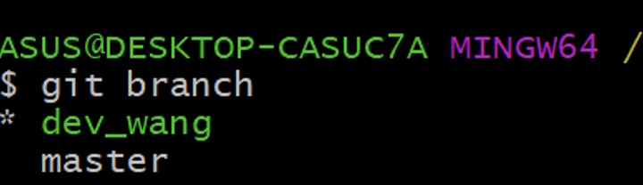

- **HEAD的一个补充：HEAD头指针指向的是当前分支最新的commitid**

  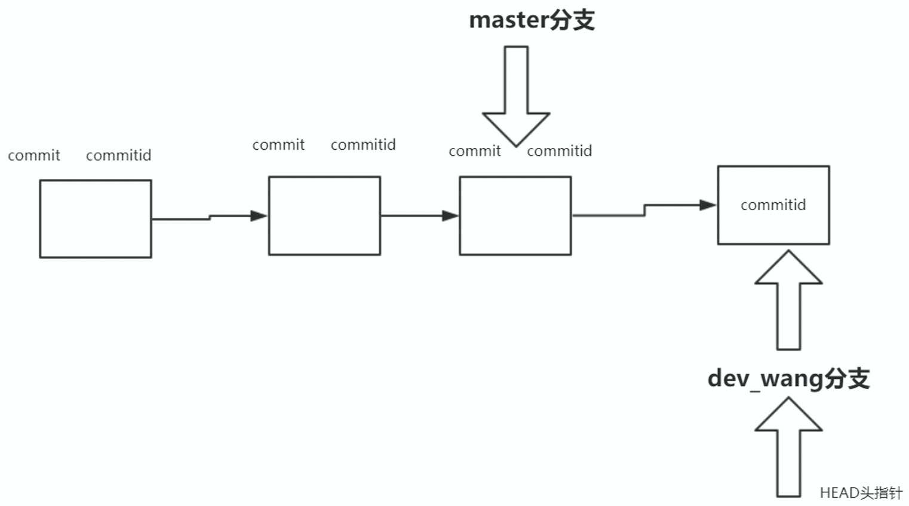

- 假设我们觉得一个分支没啥用了，想要删除该分支怎么办呢？

  - 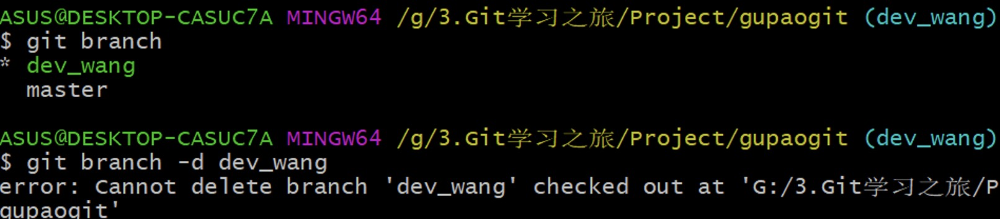
  - **现在所处的分支是dev_wang，想要删除它的话，你必须在其他分支上。**
  - 这时候你只能强制性的删除该分支 ：**git branch -D dev_wang**


## 6.3 分支合并和冲突解决

- **主分支master我们不会去动，只会用于版本的发布。**

- 各自在自己的分支上开发完成之后，需要将开发的内容**合并到主分支**上去。这个时候称为**merge**。

- 需求:一个新的开发人员dev_zhang

  （1）**git checkout -b dev_zhang;**

  （2）进行文件的修改并且**add**，**commit**

  （3）此时在**小张的分支上多了一个commitid**，这时候需要把这个小张修改的内容进行版本的发布，就需要把小张的修改内容合并到master分支上。		**切换到master分支**，**合并dev_zhang的开发内容**

  ​		合并的操作：快速合并  在master分支上，**git merge dev_zhang;**

  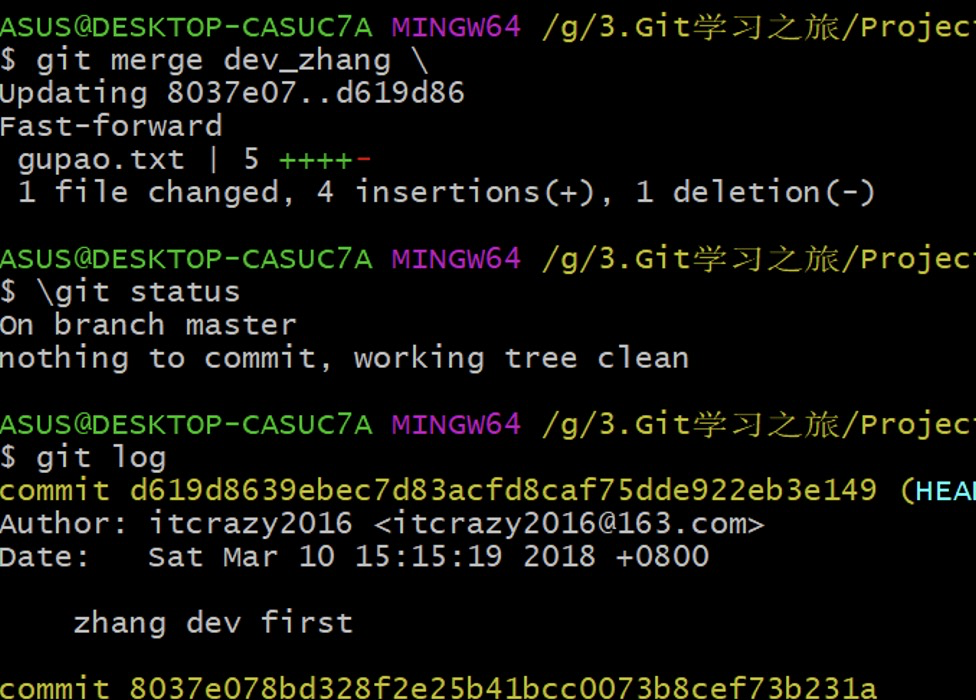

  （4）**git branch -d dev_zhang**; //上一个小节我们这样去做的时候，它有一个不能删除的提示，这个提示是告诉你需要进行分支的合并。

  

- **当你的项目开发人员很多**，2个，小张，小李，合作开发一个项目

  需求：小张，小李合作开发一个项目，这个项目两个人负责不同的模块

  小张：商品管理的模块

  小李：订单管理的模块

  - **master分支作为一个版本发布的分支，不应该进行直接在上面开发**

  - （1）git checkout -b dev_zhang

    （2）git checkout -b dev_li

    （3）分别在小张和小李的分支上进行开发之后，发现master分支上并没有小张小李的开发内容

    ​		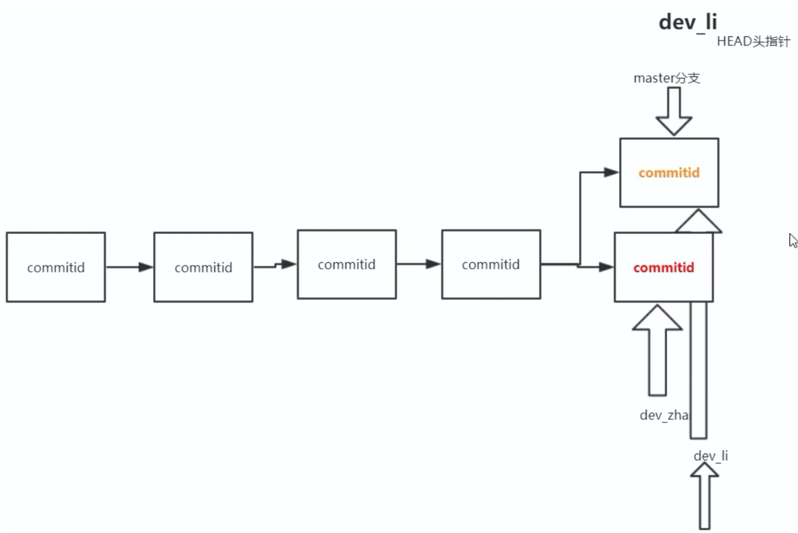

    （4）小张和小李的开发内容发布到master分支（**分支的合并**）

    - **合并的冲突的问题**

    ​			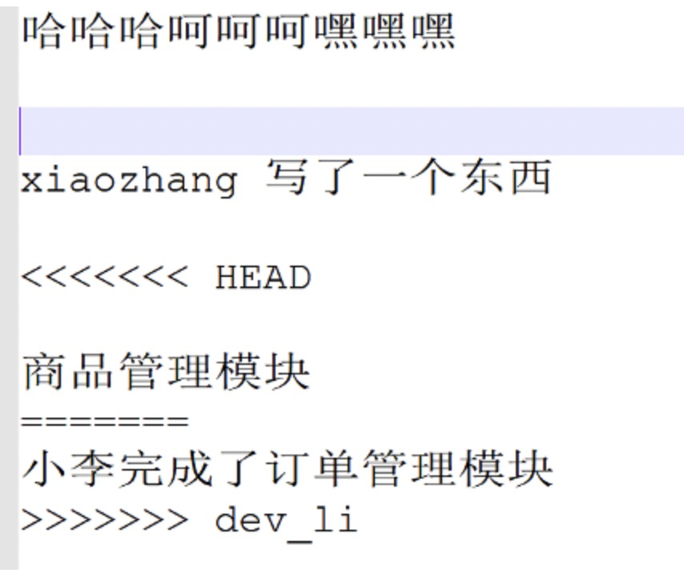

    - 需要**手动解决冲突**，并且再去进行**add**,**commit**的操作。

      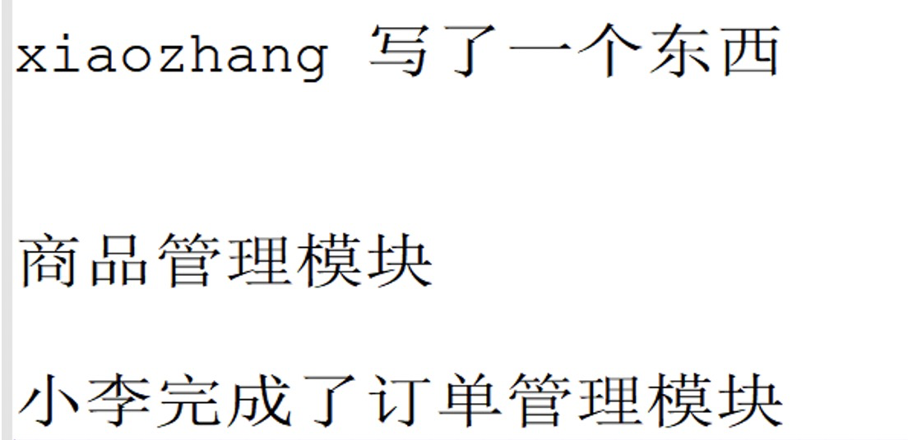


# 7.Git config和配置别名

- 在你刚装完git的时候，老师让你去配置了一个email name，只有这样你才能使用git

- git config配置git的命令

- **git config -l**  查看所有的配置信息

  - 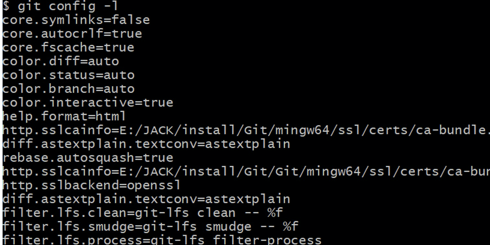

  - 这里所有的信息实际上都是整合出来的，**优先级**从上到下：仓库级别 > 全局级别 > 系统级别
    - 仓库级别： 当前**仓库级别下的.git**>config文件  ：**git config –local -l**
    - 全局级别: 当前用户之下表示的是全局级别的  **git config –global -l**
    - 系统级别: 在我们的**git安装目录下etc**    **git config –system -l**

- 增加某配置属性 ： Git config --global --add user.name itcrazy2016

- 删除某配置属性： Git config --global --unset user.name

- 修改配置文件：git config –local -e

- Git status   git add     git commit 

  Git log --pretty=oneline

  这些命令太长了，能不能简化？

  Git st  表示查看用户状态

  Git cm  提交commit

  Git log one  查看一行信息？

- **配置别名**

  - ==git config --global alias.st status  表示用st代表status。==


# 8.打标签和忽略文件

## 8.1 打标签

- 打标签：Commitid不容易记住，能不能用一种比较独特的方式去记住每个版本

  118.222.113.253  这样访问网站方便？

  [www.baidu.com](http://www.baidu.com)  域名访问网站方便？

  Commitid  as2731aa  <------>  标签

- 想要给**最新版本的id打上一个标签**  -----**git tag v1**   将最新版本的commitid对应上v1

- 查看一下当前仓库的标签列表  **git tag**

- 给之前已经错过的commitid去打上一个标签，怎么操作？
  
- **git tag v1pre d619d86(Commitid)**
  
- 这个标签你看起来还是不够过瘾，你也可以给这个**标签加上一个说明**
  
- **Git tag v2.0 -m “这里打上了一个标签”**
  
- **删除标签  git tag -d v1**

- 默认情况下，git push并不会把tag标签传送到远端服务器上，只有通过显式命令才能分享标签到远端仓库。

  - 1**.push单个tag**，命令格式为：git push origin [tagname]
    例如：git push origin v1.0   #将本地v1.0的tag推送到远端服务器
  - 2.**push所有tag**，命令格式为：git push [origin] --tags


## 8.2 忽略文件

- 创建了一个Person.class的类文件，发现git标注为Untracked file  未被追踪的文件
- Git add Person.class  肯定是可以的
- 我希望这个文件**不能被git管理起来**

  - 能不能让git将这个文件（这类文件）给忽略呢？
- **仓库的根目录下创建一个.gitignore 文件**
  - 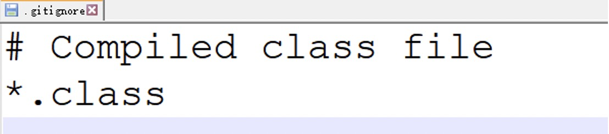
- ==从git跟踪列表移除文件==
  - **git rm --cached 文件名**
  - **git rm --cached -r 文件夹名**
- 建立了.gitignore但是发现这个文件忽略过的文件还是会被push。后来发现这个文件只对没有被git commit 过的文件有效，也就是说如果你的文件被commit过后你再建立gitignore，这个时候gitignore对这个文件是无效的。


# 9. 本地仓库和远程仓库

- 假设主分支master已经存在，这时候多了一个开发人员，你怎样给他一个分支？

  每个人要至少在自己的电脑上进行开发？

  而这个master分支仅仅用于版本的发布的。

  用一台公共的电脑作为一个远程仓库，供每个开发者使用，每个开发者可以去创建各自独立的分支进行开发，开发完成之后，把各自的代码推到远程仓库上。

  局域网：一台远程仓库  私有的公共仓库

  项目：很小，想要让所有开发者都参与进来，那么就应该有这样一台公共的让所有人都能访问的远程仓库。同时这样做的好处是：可以更加方便的管理开源代码。   大家都一起使用的仓库。

- **GitHub** 国外的远程仓库 世界各地的开发者都可以在上面进行自己代码的管理
- **码云** 国内的远程仓库  

- 问题是，你把代码放到他们上面，除非你交一些会员费，代码才不能让别人看见，不然你提交到你账号上的代码都公开的。
  
  - 搭建自己的私有仓库的话，让别人不可见，怎么做呢？**Gitlab**


# 10.操作远程和本地仓库

- push，pull 和 clone。

- 代码的内容推送 ，将本地的内容推送到具体的远程仓库上

  本地的gupaogit  -----> github/码云  gupaogit

  - （1）**要让两者有关联**

    - 在本地仓库中配置一下它和远程仓库的关系，它俩是一家人。
    - 当前本地仓库是否有远程仓库，如果有，那么它的远程仓库是什么？ **git remote**
    - 本地仓库中:git remote add 
    - origin : 本地仓库和远程仓库的地址进行一个关联  
    - **git push -u origin master**  是推送代码，那么就不是指定远程仓库。
    - 这样关联之后，接下来就是把代码推送到远程仓库上

  - （2）**本地仓库和远程仓库进行关联之后，就可以进行的推送了**

    - **git push -u origin master**  将本地仓库的内容推送到远程仓库  

    - 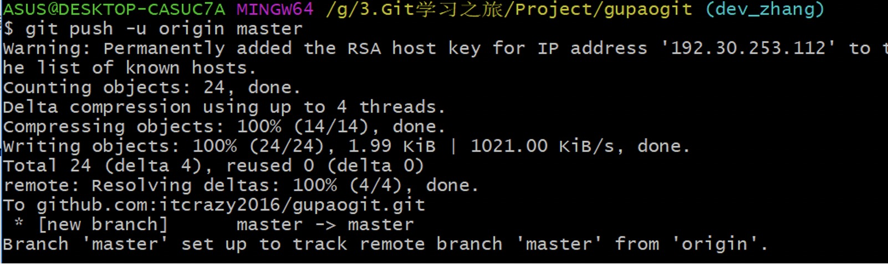

    - 无论是推送还是拉代码，需要有这样一个**权限**，也就是说你目前使用的这台电脑是否安全，如果不安全，人家不会让你去推送

    - 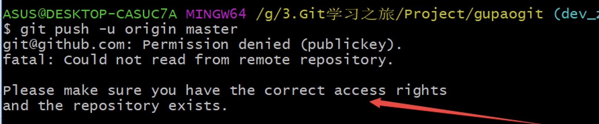

    - 【没有权限的情况下】需要添加权限

      ==A.== 需要在本地中生成一个ssh key

      ​	ssh-keygen -t rsa -C ["itcrazy2016@163.com"](mailto:"itcrazy2016@163.com")  在自己的计算中中增加一个安全ssh key, 盖上了一个章，就表示你这个电脑认证后的ssh_key.

      ==B==. 需要把这个key告诉github/码云. 把公钥放到ssh key

      ​	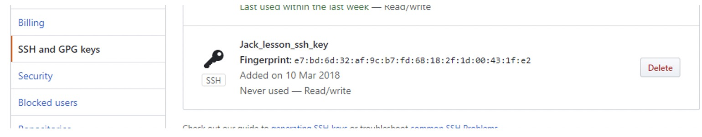

      保证数据传输的一个安全性

    - 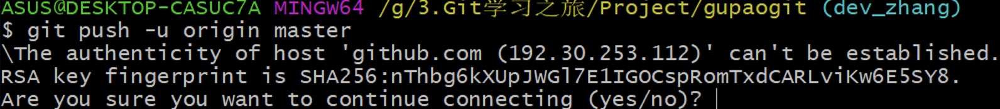

- 如果说是在其他分支进行的修改，需要进行一个分支的合并

  要推送其他分支的，指定一下要推送的分支即可**git push -u origin dev_zhang;**

- 新来了一个哥们，小王，需要进行一个开发. 需要把远程仓库的代码拉倒本地进行开发

  - （1）clone 克隆操作

    前提是：sshkey 也要添加完成

    Git clone [git@github.com:itcrazy2016/gupaogit.git](mailto:git@github.com:itcrazy2016/gupaogit.git)

  - （2）当远程仓库的版本内容如果和本地仓库的内容不一致**，需要先git pull**，把远程仓库的内容拉下来到最新版本才行，然后进行**手动解决冲突**
  
  tig


# 11.Reference

- [git official website](https://git-scm.com/)
- [pro git 参考书籍](https://git-scm.com/book/en/v2)

