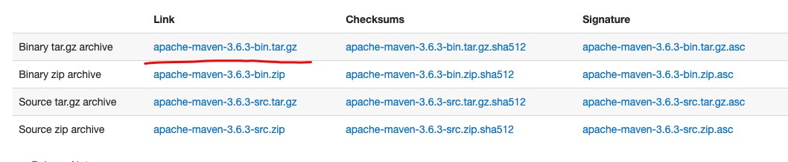
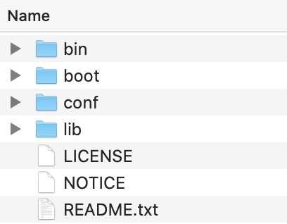
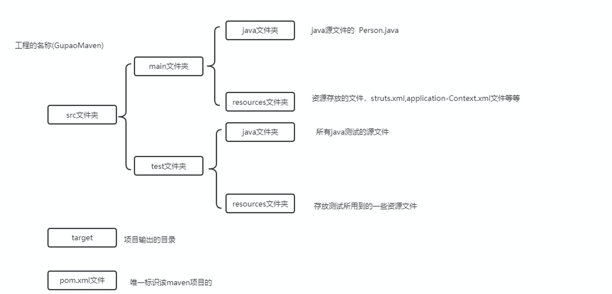

# 1.Maven 介绍

Maven的主要目标是允许开发人员在最短的时间内理解开发工作的完整状态。为了实现此目标，Maven处理了几个令人关注的领域：

- 简化构建过程
- 提供统一的构建系统
- 提供优质的项目信息
- 鼓励更好的开发实践

Maven的主要特点:

- 遵循最佳实践的简单项目设置——在几秒钟内启动一个新项目或模块
- **所有项目的用法一致** - - 意味着新开发人员无需花更多时间来进入一个项目
- **高级依赖项管理**，包括自动更新、依赖项闭包(也称为传递依赖项)
- 能够轻松轻松地同时处理多个项目
- 一个大型且不断增长的库和元数据存储库，可以开箱即用，并与最大的开放源码项目进行适当安排，以实时获得其最新版本
- 可扩展，能够轻松地用Java或脚本语言编写插件
- 只需很少或不需要额外配置就可以立即访问新特性
- 用于在Maven之外进行依赖管理和部署的Ant任务
- **基于模型的构建**:Maven能够将任意数量的项目构建为预定义的输出类型，比如基于项目元数据的JAR、WAR或发行版，而在大多数情况下不需要编写任何脚本。
- 项目信息的一致站点：使用与构建过程相同的元数据，Maven能够生成一个网站或PDF，其中包括您希望添加的任何文档，并将有关项目开发状态的标准报告添加到该标准报告中。
- **发布管理和发行发布**：无需太多额外配置，Maven将与您的源代码控制系统（例如Subversion或Git）集成，并基于特定标签管理项目的发布。它还可以将其发布到分发位置，以供其他项目使用。 Maven能够发布单个输出，例如JAR，包含其他依赖项和文档的存档或作为源分发。
- **依赖项管理**:Maven鼓励使用jar和其他依赖项的中央存储库。Maven附带了一种机制，项目的客户端可以使用该机制下载从中央JAR存储库构建项目所需的任何JAR，这与Perl的CPAN非常类似。这允许Maven的用户跨项目重用jar，并鼓励项目之间进行通信，以确保解决向后兼容性问题。

# 2. Installing Apache Maven

- http://maven.apache.org/download.cgi
- 

- Apache Maven的安装过程非常简单，只需提取归档文件并使用“mvn”命令将“bin”文件夹添加到“PATH”中。

- 确保设置了JAVA_HOME环境变量并指向JDK安装

- 在任何目录中解压:  tar xzvf apache-maven-3.6.3-bin.tar.gz

- Add the `bin` directory of the created directory `apache-maven-3.6.3` to the `PATH` environment variable

- Confirm with `mvn -v` in a new shell. The result should look similar to

  ```java
  Apache Maven 3.6.3 (cecedd343002696d0abb50b32b541b8a6ba2883f)
  Maven home: /opt/apache-maven-3.6.3
  Java version: 1.8.0_45, vendor: Oracle Corporation
  Java home: /Library/Java/JavaVirtualMachines/jdk1.8.0_45.jdk/Contents/Home/jre
  Default locale: en_US, platform encoding: UTF-8
  OS name: "mac os x", version: "10.8.5", arch: "x86_64", family: "mac"
  ```

- Check environment variable value

  ```java
  echo $JAVA_HOME
  /Library/Java/JavaVirtualMachines/jdk1.8.0_45.jdk/Contents/Home
  ```

- Adding to `PATH`

  ```java
  export PATH=/opt/apache-maven-3.6.3/bin:$PATH
  ```

# 3. Maven 目录结构

- 
- bin目录: 包含了maven运行的一些命令脚本
- boot目录：包含的是类加载器的一些东西
- conf目录：configuration配置的，保存一些配置文件的
  - settings.xml
- lib目录：保存jar包的

# 4.maven项目目录结构

- 
- The `src/main/java` directory contains the project source code
- `src/test/java` directory contains the test source
- the `pom.xml` file is the project's Project Object Model, or POM.
- `target目录` 是项目输出的一个目录
- 项目目录结构，实际上指的是maven要求你的项目必须的一个目录层次。
- 约定优于配置 (Convention Over Configuration)
- 要去使用maven帮你进行jar包的管理，以及项目的构建和管理等等，你就要遵循maven的规定/约定
- maven要求的你的工程结构必须是哪样哪样的。
- MyEclipse/IDEA 中想怎么建就怎么建，这边放这个，这边放那个。
- 有了maven之后，你就不能那么随心所欲的。

# 5. maven配置文件之settings.xml

- http://maven.apache.org/settings.html

The `settings` element in the `settings.xml` file contains elements used to define values which configure Maven execution in various ways, like the `pom.xml`, but should not be bundled to any specific project, or distributed to an audience. These include values such as the local repository location, alternate remote repository servers, and authentication information.

设置中的“设置”元素。xml文件包含用于定义以各种方式配置Maven执行的值的元素，如“pom.xml”，但不应该绑定到任何特定项目。这些值包括本地存储库位置、备用远程存储库服务器和身份验证信息。

There are **two locations** where a `settings.xml` file may live:

- The Maven install: `${maven.home}/conf/settings.xml`
- A user’s install: `${user.home}/.m2/settings.xml`

The former `settings.xml` are also called **global settings**, the latter `settings.xml` are referred to as **user settings**. **If both files exists, their contents gets merged**, with the **user-specific** `settings.xml` being **dominant**.

Tip: If you need to create user-specific settings from scratch, it’s easiest to copy the global settings from your Maven installation to your `${user.home}/.m2` directory. Maven’s default `settings.xml` is a template with comments and examples so you can quickly tweak it to match your needs.

Here is an overview of the top elements under `settings`:

```xml
  <settings xmlns="http://maven.apache.org/SETTINGS/1.0.0"
      xmlns:xsi="http://www.w3.org/2001/XMLSchema-instance"
      xsi:schemaLocation="http://maven.apache.org/SETTINGS/1.0.0
                          https://maven.apache.org/xsd/settings-1.0.0.xsd">
      <localRepository/>
      <interactiveMode/>
      <offline/>
      <pluginGroups/>
      <servers/>
      <mirrors/>
      <proxies/>
      <profiles/>
      <activeProfiles/>
    </settings>
```

## Settings Details

- **Simple Values**

  ```xml
  <settings xmlns="http://maven.apache.org/SETTINGS/1.0.0"
    xmlns:xsi="http://www.w3.org/2001/XMLSchema-instance"
    xsi:schemaLocation="http://maven.apache.org/SETTINGS/1.0.0
                        https://maven.apache.org/xsd/settings-1.0.0.xsd">
    <localRepository>${user.home}/.m2/repository</localRepository>
    <interactiveMode>true</interactiveMode>
    <offline>false</offline>
    ...
  </settings>
  ```

  - **localRepository**: This value is the path of this build system’s local repository. The **default value** is `${user.home}/.m2/repository`. This element is especially useful for a main build server allowing all logged-in users to build from a common local repository.
  - **interactiveMode**: `true` if Maven should attempt to interact with the user for input, `false` if not. Defaults to `true`.
  - **offline**: `true` if this build system should operate in offline mode, defaults to `false`. This element is useful for build servers which cannot connect to a remote repository, either because of network setup or security reasons.

- **Plugin Groups**: This element contains a list of `pluginGroup` elements, each contains a groupId. The list is searched when a plugin is used and the groupId is not provided in the command line. This list **automatically contains** `org.apache.maven.plugins` and `org.codehaus.mojo`.

  ```xml
  <settings xmlns="http://maven.apache.org/SETTINGS/1.0.0"
    xmlns:xsi="http://www.w3.org/2001/XMLSchema-instance"
    xsi:schemaLocation="http://maven.apache.org/SETTINGS/1.0.0
                        https://maven.apache.org/xsd/settings-1.0.0.xsd">
    ...
    <pluginGroups>
      <pluginGroup>org.eclipse.jetty</pluginGroup>
    </pluginGroups>
    ...
  </settings>
  ```

  For example, **given the above settings** the Maven command line may execute `org.eclipse.jetty:jetty-maven-plugin:run` with the truncated command:

  ```shell
  mvn jetty:run
  ```

- **Mirrors:** 表示配置镜像所在的路径的.默认的地址是国外的：https://repo.maven.apache...，maven要帮你管理jar，这些jar包下载的地址是从该地址下的，当然这个下载地址可以改变，就是通过mirrors标签。

  ```xml
  <settings xmlns="http://maven.apache.org/SETTINGS/1.0.0"
    xmlns:xsi="http://www.w3.org/2001/XMLSchema-instance"
    xsi:schemaLocation="http://maven.apache.org/SETTINGS/1.0.0
                        https://maven.apache.org/xsd/settings-1.0.0.xsd">
    ...
    <mirrors>
      <mirror>
        <id>alimaven</id>  
        <name>aliyun maven</name>  
        <url>http://maven.aliyun.com/nexus/content/groups/public/</url>  
        <mirrorOf>central</mirrorOf>          
      </mirror>
    </mirrors>
    ...
  </settings>
  ```

  - **id**, **name**: The unique identifier and user-friendly name of this mirror. The `id` is used to differentiate between `mirror` elements and to pick the corresponding credentials from the [`<servers>`](http://maven.apache.org/settings.html#Servers) section when connecting to the mirror.
  - **url**: The base URL of this mirror. The build system will **use this URL to connect to a repository** rather than the original repository URL.
  - **mirrorOf**: The `id` of the repository that this is a mirror of. For example, to point to a mirror of the Maven `central` repository (`https://repo.maven.apache.org/maven2/`), set this element to `central`. More advanced mappings like `repo1,repo2` or `*,!inhouse` are also possible. This must not match the mirror `id`.

# 6.maven 仓库

- maven把jar包自动下载下来之后，这个保存jar包的目录是由我们自己指定，你自己可以指定这个目录存储的位置，当然，它也有一个默认的位置。

- 在maven构建项目的时候，它会帮我们把项目中所需要的一些基础的jar包下载下来，这个下载的地址就是由settings.xml文件里面的mirror标签所指定的。

- maven仓库，实际上指的就是jar包下载下来之后保存的目录。

- maven仓库保存在自己电脑中的叫做本地仓库，localRepository的含义本地仓库。

- <localRepository>E://temp//myrepo</localRepository>  自己指定了一个本地maven仓库所在的地址，而不是之前默认的当前用户的.m2下面的repository文件夹了。

- 如果一个jar包已经在本地仓库中有了，注意这个jar包版本一定是要一致的才算有了，如果版本不一致，不能算作有，比如3.8.1  3.8.2。其他如果有了，那么就不会再次去重复下载。这样可以节约本地的一个空间存储。

  

# 7.maven配置文件之pom.xml

- http://maven.apache.org/pom.html

- pom  project object model  项目对象模型，它为唯一标识该项目的

- 3个必填字段

  - 由groupId  artifactId  version所组成的就可以唯一确定一个项目

  - groupId 标识的项目组（填写公司的域名） 组织

  - artifactId 项目名称  

  - version 版本号

- pom里面还有会dependencies标签，这个标签就是用来配置我们项目中具体需要哪些jar包

- properties标签，用来定义pom中的一些属性的

- build  指定如何构建当前项目的

- source:  指定了当前构建的source目录

- plugin:  指定了进行构建时使用的插件

- packging  指定当前构建项目的类型
  - ` <packaging>war</packaging>`
  - When no packaging is declared, Maven assumes the packaging is the **default**: `jar`. 
  - The current core packaging values are: `pom`, `jar`, `maven-plugin`, `ejb`, `war`, `ear`, `rar`

- **pom文件是可以继承的**，超级pom文件等等。
  - 比如一定pom文件中定义了一些东西，另外一个pom文件也想要使用，这时候就可以使用继承的方式。
  - 

```xml
<project xmlns="http://maven.apache.org/POM/4.0.0"
  xmlns:xsi="http://www.w3.org/2001/XMLSchema-instance"
  xsi:schemaLocation="http://maven.apache.org/POM/4.0.0
                      http://maven.apache.org/xsd/maven-4.0.0.xsd">
  <modelVersion>4.0.0</modelVersion>
 
  <!-- The Basics -->
  <groupId>...</groupId>
  <artifactId>...</artifactId>
  <version>...</version>
  <packaging>...</packaging>
  <dependencies>...</dependencies>
  <parent>...</parent>
  <dependencyManagement>...</dependencyManagement>
  <modules>...</modules>
  <properties>...</properties>
 
  <!-- Build Settings -->
  <build>...</build>
  <reporting>...</reporting>
 
  <!-- More Project Information -->
  <name>...</name>
  <description>...</description>
  <url>...</url>
  <inceptionYear>...</inceptionYear>
  <licenses>...</licenses>
  <organization>...</organization>
  <developers>...</developers>
  <contributors>...</contributors>
 
  <!-- Environment Settings -->
  <issueManagement>...</issueManagement>
  <ciManagement>...</ciManagement>
  <mailingLists>...</mailingLists>
  <scm>...</scm>
  <prerequisites>...</prerequisites>
  <repositories>...</repositories>
  <pluginRepositories>...</pluginRepositories>
  <distributionManagement>...</distributionManagement>
  <profiles>...</profiles>
</project>
```

# 8.Reference

- [maven 官网](http://maven.apache.org/index.html)
- [下载](http://maven.apache.org/download.cgi)
- [安装](http://maven.apache.org/install.html)
- [settings.xml](http://maven.apache.org/settings.html)
- [pom.xml](http://maven.apache.org/pom.html)
- [guide](http://maven.apache.org/guides/getting-started/index.html)

