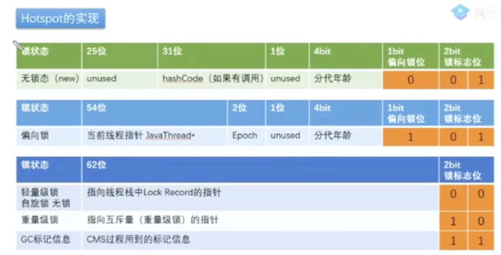

# 一, 线程与进程的概念

## 并行和并发

**并行**：同时执行多个任务，在多核心CPU架构中，一个CPU核心运行一个线程，那么4核心CPU，可以同时执行4个线程
**并发**：同处理多个任务的能力,通常我们会通过TPS或者QPS来表示某某系统支持的并发数是多少。


## **线程进程的区别**

- 根本区别
  - **进程**是**操作系统资源分配**的基本单位
  - **线程**是**任务调度和执行**的基本单位

- 在开销方面
  - **每个进程都有独立的代码和数据空间**(程序上下文)，**程序之间的切换会有较大的开销**;
  - 线程可以看做轻量级的进程，**同一类线程共享代码和数据空间，每个线程都有自己独立的运行栈和程序计数器** (PC)，**线程之间切换的开销小**。

- 所处环境
  - 在操作系统中能同时运行多个进程(程序);
  - 在**同一个进程**(程序)中有多个线程同时执行 (通过CPU调度，在每个时间片中只有一个线程执行)

- 内存分配方面

  - 系统在运行的时候会为每个进程分配不同的内存空间;

  - 而对线程而言，除了CPU外，系统不会为线程分配内存(线程所使用的资源来自其所属进程的资源)，线程组之间只能共享资源。

- 包含关系
  - 没有线程的进程可以看做是单线程的，如果一个进程内有多个线程，则执行过程不是一条线的， 而是多条线(线程)共同完成的;线程是进程的一部分，所以线程也被称为轻权进程或者**轻量级进程**。


# 二, 线程在Java中的使用

##  java 中线程的三种实现方式

在Java中实现多线程的方式比较简单，因为Java中提供了非常方便的API来实现多线程。
1.继承Thread类实现多线程
2.实现Runnable接口
3.实现Callable接口通过Future包装器来创建Thread线程，这种是带返回值的线程

### 1. 继承Thread类

继承Thread类，然后重写run方法，在run方法中编写当前线程需要执行的逻辑。最后通过线程实例的start方法来启动一个线程

```java
public class ThreadDemo extends Thread{
    @Override
    public void run() {
        //重写run方法，提供当前线程执行的逻辑
        System.out.println("Hello world");
    }
    public static void main(String[] args) {
        ThreadDemo threadDemo=new ThreadDemo();
        threadDemo.start();
    }
}
```

### 2. 实现Runnable接口

如果需要使用线程的类已经继承了其他的类，那么按照Java的单一继承原则，无法再继承Thread类来实现线程，所以可以通过实现Runnable接口来实现多线程

```java
public class RunnableDemo implements Runnable{
    @Override
    public void run() {
        //重写run方法，提供当前线程执行的逻辑
        System.out.println("Hello world");
    }
    public static void main(String[] args) {
        RunnableDemo runnableDemo=new RunnableDemo();
        new Thread(runnableDemo).start();
    }
}
```

### 3. 实现Callable接口

在有些多线程使用的场景中，我们有时候需要获取异步线程执行完毕以后的反馈结果，也许是主线程需要拿到子线程的执行结果来处理其他业务逻辑，也许是需要知道线程执行的状态。那么Callable接口可以很好的实现这个功能

```java
public class CallableDemo implements Callable<String>{
    @Override
    public String call() throws Exception {
        return "hello world";
    }
    public static void main(String[] args) throws ExecutionException, InterruptedException {
        Callable<String> callable=new CallableDemo();
        FutureTask<String> task=new FutureTask<>(callable);
        new Thread(task).start();
        System.out.println(task.get());//获取线程的返回值
    }
}
```

在上面代码案例中的最后一行 task.get()就是获取线程的返回值，这个过程是阻塞的，当子线程还没有执行完的时候，主线程会一直阻塞直到结果返回


### 实现接口 VS 继承 Thread

实现Runnable接口相对于继承Thread类来说，有如下显著的好处

- 适合**多个相同程序代码的线程去处理同一资源**的情况，把虚拟CPU（线程）同程序的代码，数据有效的分离，较好地体现了面向对象的设计思想。 
- 可以避免由于Java的**单继承特性带来的局限**。我们经常碰到这样一种情况，即当我们要将已经继承了某一个类的子类放入多线程中，由于一个类不能同时有两个父类，所以不能用继承Thread类的方式，那么，这个类就只能采用实现Runnable接口的方式了。 
- 有利于程序的健壮性，代码能够被多个线程共享，代码与数据是独立的。当**多个线程的执行代码来自同一个类的实例时，即称它们共享相同的代码**。多个线程操作相同的数据，与它们的代码无关。当共享访问相同的对象是，即它们共享相同的数据。当线程被构造时，需要的代码和数据通过一个对象作为构造函数实参传递进去，这个对象就是一个实现了Runnable接口的类的实例。 

### `Runnable` vs `Callable`

`Runnable`自 Java 1.0 以来一直存在，但`Callable`仅在 Java 1.5 中引入,目的就是为了来处理`Runnable`不支持的用例。**`Runnable` 接口**不会返回结果或抛出检查异常，但是**`Callable` 接口**可以。所以，如果任务不需要返回结果或抛出异常推荐使用 **`Runnable` 接口**，这样代码看起来会更加简洁。


## 线程启动原理

[Start0() 原理](https://segmentfault.com/a/1190000017255007)

Java的里面创建线程之后必须要调用启动方法才能真正的创建一个线程，该方法会调用虚拟机启动一个本地线程( start0() )，本地线程的创建会调用当前系统创建线程的方法（os :: start_thread（thread））进行创建，并且线程被执行的时候会回调 run() 方法进行业务逻辑的处理.


## 线程的生命周期

线程是存在生命周期的，从线程的创建到销毁，可能会经历6种不同的状态，但是在一个时刻线程只能处于其中一种状态

- NEW：初始状态，线程被创建时候的状态，还没有调用start方法

- RUNNABLE：运行状态，运行状态包含就绪和运行两种状态，因为线程启动以后，并不是立即执行，而是需要通过调度去分配CPU时间片

- BLOCKED：阻塞状态，当线程去访问一个加锁的方法时，如果已经有其他线程获得锁，那么当前线程会处于阻塞状态

- WAITING：等待状态，设置线程进入等待状态等待其他线程做一些特定的动作进行触发

- TIME_WAITING：超时等待状态，和WAITING状态的区别在于超时以后自动返回

- TERMINATED：终止状态，线程执行完毕

  ​				 		

### BLOCKED VS. WAITING

- BLOCKED状态是指当前线程在等待一个获取锁的操作时的状态。

- WAITING是通过Object.wait或者Thread.join、LockSupport.park等操作实现的

- BLOCKED是被动的标记，而WAITING是主动操作

- 如果说得再深入一点，处于WAITING状态的线程，被唤醒以后，需要进入同步队列去竞争锁操作，而在同步队列中，如果已经有其他线程持有锁，则线程会处于BLOCKED状态。所以可以说BLOCKED状态是处于WAITING状态的线程重新唤醒的*必经的状态*

  

### **sleep() VS. wait() **

- 两者最主要的区别在于:sleep 方法没有释放锁，而 wait 方法释放了锁 。 
- 两者都可以暂停线程的执行。

- Wait 通常被用于线程间交互/通信，sleep 通常被用于暂停执行。

- wait() 方法被调用后，线程不会自动苏醒，需要别的线程调用同一个对象上的 notify() 或者 notifyAll()

  方法。sleep() 方法执行完成后，线程会自动苏醒。或者可以使用wait(long timeout)超时后线程会自动苏醒。

  

## **线程的应用场景**

线程的出现，在多核心CPU架构下实现了真正意义上的并行执行。也就是说，一个进程内多个任务可以通过多线程并行执行来提高程序运行的性能。那线程的使用场景有哪些呢？

- 执行后台任务，在很多场景中，可能会有一些定时的批量任务，比如定时发送短信、定时生成批量文件。在这些场景中可以通过多线程的来执行
- 异步处理，比如在用户注册成功以后给用户发送优惠券或者短信，可以通过异步的方式来执行，一方面提升主程序的执行性能；另一方面可以解耦核心功能，防止非核心功能对核心功能造成影响
- 分布式处理，比如fork/join，将一个任务拆分成多个子任务分别执行
- BIO模型中的线程任务分发，也是一种比较常见的使用场景，一个请求对应一个线程。

**合理的利用多线程，可以提升程序的吞吐量。同时，还可以通过增加CPU的核心数来提升程序的性能，这就体现了伸缩性的特点**


# 三, 线程池

## 为什么要用线程池

线程池提供了一种限制和管理资源(包括执行一个任务)。 每个线程池还维护一些基本 统计信息，例如已完成任务的数量。

- ==降低资源消耗==。 通过**重复利用已创建的线程**降低线程创建和销毁造成的消耗。

- ==提高响应速度==。 当任务到达时，任务可以**不需要的等到线程创建就能立即执行**。

- ==提高线程的可管理性==。 线程是稀缺资源，**如果无限制的创建，不仅会消耗系统资 源，还会降低系统的稳定性**，使用线程池可以进行统一的分配，调优和监控。

  

## Executor 框架

ThreadPoolExecutor,AbstractExecutorService、ExecutorService和Executor 几个之间的关系

- Executor是一个顶层接口，在它里面只声明了一个方法execut e(Runnable)，返回值为void， 参数为Runnable类型，从字面意思可以理解，就是用来执行传进去的任务的;

-  然后ExecutorService接口继承了Executor接口，并声明了一些方法:submit 、invokeAll、 invokeAny以及shutDown等;

- 抽象类AbstractExecutorService实现了ExecutorService接口(定义是否为"public"等)，基本实现了ExecutorService中声明的所有方法;

-  然后ThreadPoolExecut or继承了类AbstractExecutorService。在ThreadPoolExecutor类中有几个非常重要的方法:

  execute(), submit(), shutdown(), shutdownNow()


### ThreadPoolExecutor 类分析

线程池实现类 `ThreadPoolExecutor` 是 `Executor` 框架最核心的类。

#### 构造函数分析

```java
  /**
     * 用给定的初始参数创建一个新的ThreadPoolExecutor。
     */
    public ThreadPoolExecutor(int corePoolSize,//线程池的核心线程数量
                              int maximumPoolSize,//线程池的最大线程数
                              long keepAliveTime,//当线程数大于核心线程数时，多余的空闲线程存活的最长时间
                              TimeUnit unit,//时间单位
                              BlockingQueue<Runnable> workQueue,//任务队列，用来储存等待执行任务的队列
                              ThreadFactory threadFactory,//线程工厂，用来创建线程，一般默认即可
                              RejectedExecutionHandler handler//拒绝策略，当提交的任务过多而不能及时处理时，我们可以定制策略来处理任务
                               ) {
        if (corePoolSize < 0 ||
            maximumPoolSize <= 0 ||
            maximumPoolSize < corePoolSize ||
            keepAliveTime < 0)
            throw new IllegalArgumentException();
        if (workQueue == null || threadFactory == null || handler == null)
            throw new NullPointerException();
        this.corePoolSize = corePoolSize;
        this.maximumPoolSize = maximumPoolSize;
        this.workQueue = workQueue;
        this.keepAliveTime = unit.toNanos(keepAliveTime);
        this.threadFactory = threadFactory;
        this.handler = handler;
    }
```

**`ThreadPoolExecutor` 3 个最重要的参数：**

- **`corePoolSize` :** 核心线程数线程数定义了最小可以同时运行的线程数量。
- **`maximumPoolSize` :** 当队列中存放的任务达到队列容量的时候，当前可以同时运行的线程数量变为最大线程数。
- **`workQueue`:** 当新任务来的时候会先判断当前运行的线程数量是否达到核心线程数，如果达到的话，新任务就会被存放在队列中。

**`ThreadPoolExecutor`其他常见参数:**

1. **`keepAliveTime`**:当线程池中的线程数量大于 `corePoolSize` 的时候，如果这时没有新的任务提交，核心线程外的线程不会立即销毁，而是会等待，直到等待的时间超过了 `keepAliveTime`才会被回收销毁；

2. **`unit`** : `keepAliveTime` 参数的时间单位。

3. **`threadFactory`** :executor 创建新线程的时候会用到。

4. **`handler`** :饱和策略

   如果当前同时运行的线程数量达到最大线程数量并且队列也已经被放满了任务时，`ThreadPoolTaskExecutor` 定义一些策略:

   - **`ThreadPoolExecutor.AbortPolicy`**：抛出 `RejectedExecutionException`来拒绝新任务的处理。

   - **`ThreadPoolExecutor.CallerRunsPolicy`**：调用执行自己的线程运行任务，也就是直接在调用`execute`方法的线程中运行(`run`)被拒绝的任务，如果执行程序已关闭，则会丢弃该任务。因此这种策略会降低对于新任务提交速度，影响程序的整体性能。如果您的应用程序可以承受此延迟并且你要求任何一个任务请求都要被执行的话，你可以选择这个策略。

   - **`ThreadPoolExecutor.DiscardPolicy`：** 不处理新任务，直接丢弃掉。

   - **`ThreadPoolExecutor.DiscardOldestPolicy`：** 此策略将丢弃最早的未处理的任务请求。

     

#### execute()` vs `submit()

1. **`execute()`方法用于提交不需要返回值的任务，所以无法判断任务是否被线程池执行成功与否；**

2. **`submit()`方法用于提交需要返回值的任务。线程池会返回一个 `Future` 类型的对象，通过这个 `Future` 对象可以判断任务是否执行成功**，并且可以通过 `Future` 的 `get()`方法来获取返回值，`get()`方法会阻塞当前线程直到任务完成，而使用 `get（long timeout，TimeUnit unit）`方法则会阻塞当前线程一段时间后立即返回，这时候有可能任务没有执行完。

3. 我们以**`AbstractExecutorService`**接口中的一个 `submit` 方法为例子来看看源代码：

   ```java
   public Future<?> submit(Runnable task) {
           if (task == null) thrownew NullPointerException();
           RunnableFuture<Void> ftask = newTaskFor(task, null);
           execute(ftask);
           return ftask;
       }
   ```

   上面方法调用的 `newTaskFor` 方法返回了一个 `FutureTask` 对象。

   ```java
   protected <T> RunnableFuture<T> newTaskFor(Runnable runnable, T value) {
           returnnew FutureTask<T>(runnable, value);
       }
   ```

   我们再来看看`execute()`方法：

   ```java
   public void execute(Runnable command) {
         ...
       }
   ```

#### shutdown() ` VS ` shutdownNow()

- **`shutdown（）`** :关闭线程池，线程池的状态变为 `SHUTDOWN`。线程池不再接受新任务了，但是队列里的任务得执行完毕。

- **`shutdownNow（）`** : 立即终止线程池，并尝试打断正在执行的任务，并且清空任务缓存队列，返回尚未执行的任务。

  

#### isTerminated()` VS `isShutdown()

- **`isShutDown`** 当调用 `shutdown()` 方法后返回为 true。
- **`isTerminated`** 当调用 `shutdown()` 方法后，并且所有提交的任务完成后返回为 true


### 几种常见的线程池详解

#### FixedThreadPool 

被称为可重用固定线程数的线程池。通过 Executors 类中的相关源代码来看一下相关实现：

```java
   /**
     * 创建一个可重用固定数量线程的线程池
     */
    public static ExecutorService newFixedThreadPool(int nThreads, ThreadFactory threadFactory) {
        return new ThreadPoolExecutor(nThreads, nThreads,
                                      0L, TimeUnit.MILLISECONDS,
                                      new LinkedBlockingQueue<Runnable>(),
                                      threadFactory);
    }
```

**从上面源代码可以看出新创建的 `FixedThreadPool` 的 `corePoolSize` 和 `maximumPoolSize` 都被设置为 nThreads，这个 nThreads 参数是我们使用的时候自己传递的。**

**为什么不推荐使用`FixedThreadPool`？**

**`FixedThreadPool` 使用无界队列 `LinkedBlockingQueue`（队列的容量为 Intger.MAX_VALUE）作为线程池的工作队列会对线程池带来如下影响 ：**

1. 当线程池中的线程数达到 `corePoolSize` 后，新任务将在无界队列中等待，因此线程池中的线程数不会超过 corePoolSize；

2. 由于使用无界队列时 `maximumPoolSize` 将是一个无效参数，因为不可能存在任务队列满的情况。所以，通过创建 `FixedThreadPool`的源码可以看出创建的 `FixedThreadPool` 的 `corePoolSize` 和 `maximumPoolSize` 被设置为同一个值。

3. 由于 1 和 2，使用无界队列时 `keepAliveTime` 将是一个无效参数；

4. 运行的 `FixedThreadPool`（未执行 `shutdown()`或 `shutdownNow()`）不会拒绝任务，在任务比较多的时候会导致 OOM（内存溢出）

   

#### SingleThreadExecutor

`SingleThreadExecutor` 是只有一个线程的线程池。下面看看**SingleThreadExecutor 的实现：**

```java
   /**
     *返回只有一个线程的线程池
     */
    public static ExecutorService newSingleThreadExecutor(ThreadFactory threadFactory) {
        return new FinalizableDelegatedExecutorService
            (new ThreadPoolExecutor(1, 1,
                                    0L, TimeUnit.MILLISECONDS,
                                    new LinkedBlockingQueue<Runnable>(),
                                    threadFactory));
    }
```

从上面源代码可以看出新创建的 `SingleThreadExecutor` 的 `corePoolSize` 和 `maximumPoolSize` 都被设置为 1.其他参数和 `FixedThreadPool` 相同。

**为什么不推荐使用`SingleThreadExecutor`？**

`SingleThreadExecutor` 使用无界队列 `LinkedBlockingQueue` 作为线程池的工作队列（队列的容量为 Intger.MAX_VALUE）。`SingleThreadExecutor` 使用无界队列作为线程池的工作队列会对线程池带来的影响与 `FixedThreadPool` 相同。说简单点就是可能会导致 OOM


#### CachedThreadPool 

`CachedThreadPool` 是一个会根据需要创建新线程的线程池。下面通过源码来看看 `CachedThreadPool` 的实现：

```java
    /**
     * 创建一个线程池，根据需要创建新线程，但会在先前构建的线程可用时重用它。
     */
    public static ExecutorService newCachedThreadPool(ThreadFactory threadFactory) {
        return new ThreadPoolExecutor(0, Integer.MAX_VALUE,
                                      60L, TimeUnit.SECONDS,
                                      new SynchronousQueue<Runnable>(),
                                      threadFactory);
    }
```

`CachedThreadPool` 的`corePoolSize` 被设置为空（0），`maximumPoolSize`被设置为 Integer.MAX.VALUE，即它是无界的，这也就意味着如果主线程提交任务的速度高于 `maximumPool` 中线程处理任务的速度时，`CachedThreadPool` 会不断创建新的线程。极端情况下，这样会导致耗尽 cpu 和内存资源。

**为什么不推荐使用`CachedThreadPool`？**

`CachedThreadPool`允许创建的线程数量为 Integer.MAX_VALUE ，可能会创建大量线程，从而导致 OOM。


#### ScheduledThreadPoolExecutor

**`ScheduledThreadPoolExecutor` 主要用来在给定的延迟后运行任务，或者定期执行任务。** 这个在实际项目中基本不会被用到，因为有其他方案选择比如`quartz`


## 线程池原理


**任务被提交到线程池，会先判断当前线程数量是否小于corePoolSize，如果小于则创建线程来执行提交的 任务，否则将任务放入workQueue队列，如果workQueue满了，则判断当前线程数量是否小于 maximumPoolSize,如果小于则创建线程执行任务，否则就会调用handler，以表示线程池拒绝接收任务。**


### 1.首先分析一下 `execute`方法

```java
// 存放线程池的运行状态 (runState) 和线程池内有效线程的数量 (workerCount)
   private final AtomicInteger ctl = new AtomicInteger(ctlOf(RUNNING, 0));
   
    private static int workerCountOf(int c) {
        return c & CAPACITY;
    }
    //任务队列
    private final BlockingQueue<Runnable> workQueue;

    public void execute(Runnable command) {
        // 如果任务为null，则抛出异常。
        if (command == null)
            throw new NullPointerException();
        // ctl 中保存的线程池当前的一些状态信息
        int c = ctl.get();
      
       /*
         * 分三步进行：
         *
         * 1、如果运行的线程少于 corePoolSize，尝试开启一个新的线程；否则尝试进入工作队列
         *
         * 2. 如果工作队列没满，则进入工作队列；否则 判断是否超出最大线程数
         *
         * 3. 如果未超出最大线程数，则尝试开启一个新的线程；否则 按饱和策略处理无法执行的任务
         */
      
        // 1.首先判断当前线程池中之行的任务数量是否小于 corePoolSize
        // 如果小于的话，通过addWorker(command, true)新建一个线程，并将任务(command)添加到该线程中；然后，启动该线程从而执行任务。
        if (workerCountOf(c) < corePoolSize) {
            if (addWorker(command, true))
                return;
            c = ctl.get();
        }
        // 2.如果当前执行的任务数量大于等于 corePoolSize 的时候就会走到这里
        // 通过 isRunning 方法判断线程池状态，线程池处于 RUNNING 状态队列才可以加入任务
        if (isRunning(c) && workQueue.offer(command)) {
            int recheck = ctl.get();
            // 再次获取线程池状态，如果线程池状态不是 RUNNING 状态就需要从任务队列中移除任务，并尝试判断线程是否全部执行完毕。同时执行拒绝策略。
            if (!isRunning(recheck) && remove(command))
                reject(command);
                // 如果当前线程池为空就新创建一个线程并执行。
            else if (workerCountOf(recheck) == 0)
                addWorker(null, false);
        }
        //3. 通过addWorker(command, false)新建一个线程，并将任务(command)添加到该线程中；然后，启动该线程从而执行任务。
        //如果addWorker(command, false)执行失败，则通过reject()执行相应的拒绝策略的内容。
        else if (!addWorker(command, false))
            reject(command);
    }
```


### **2.addWorker** 

**这个方法主要用来创建新的工作线程，如果返回true说明创建和启动工作线程成功，否则的话返回的就是false。**

```java
 // 全局锁，并发操作必备
    private final ReentrantLock mainLock = new ReentrantLock();
    // 跟踪线程池的最大大小，只有在持有全局锁mainLock的前提下才能访问此集合
    private int largestPoolSize;
    // 工作线程集合，存放线程池中所有的（活跃的）工作线程，只有在持有全局锁mainLock的前提下才能访问此集合
    private final HashSet<Worker> workers = new HashSet<>();
    //获取线程池状态
    private static int runStateOf(int c)     { return c & ~CAPACITY; }
    //判断线程池的状态是否为 Running
    private static boolean isRunning(int c) {
        return c < SHUTDOWN;
    }


    /**
     * 添加新的工作线程到线程池
     * @param firstTask 要执行
     * @param core参数为true的话表示使用线程池的基本大小，为false使用线程池最大大小
     * @return 添加成功就返回true否则返回false
     */
   private boolean addWorker(Runnable firstTask, boolean core) {
        retry:
        for (;;) {
            //这两句用来获取线程池的状态
            int c = ctl.get();
            int rs = runStateOf(c);

            // Check if queue empty only if necessary.
            if (rs >= SHUTDOWN &&
                ! (rs == SHUTDOWN &&
                   firstTask == null &&
                   ! workQueue.isEmpty()))
                return false;

            for (;;) {
               //获取线程池中线程的数量
                int wc = workerCountOf(c);
                // core参数为true的话表明队列也满了，线程池大小变为 maximumPoolSize 
                if (wc >= CAPACITY ||
                    wc >= (core ? corePoolSize : maximumPoolSize))
                    return false;
               //原子操作将workcount的数量加1
                if (compareAndIncrementWorkerCount(c))
                    break retry;
                // 如果线程的状态改变了就再次执行上述操作
                c = ctl.get();  
                if (runStateOf(c) != rs)
                    continue retry;
                // else CAS failed due to workerCount change; retry inner loop
            }
        }
        // 标记工作线程是否启动成功
        boolean workerStarted = false;
        // 标记工作线程是否创建成功
        boolean workerAdded = false;
        Worker w = null;
        try {
        
            w = new Worker(firstTask);
            final Thread t = w.thread;
            if (t != null) {
              // 加锁
                final ReentrantLock mainLock = this.mainLock;
                mainLock.lock();
                try {
                   //获取线程池状态
                    int rs = runStateOf(ctl.get());
                   //rs < SHUTDOWN 如果线程池状态依然为RUNNING,并且线程的状态是存活的话，就会将工作线程添加到工作线程集合中
                  //(rs=SHUTDOWN && firstTask == null)如果线程池状态小于STOP，也就是RUNNING或者SHUTDOWN状态下，同时传入的任务实例firstTask为null，则需要添加到工作线程集合和启动新的Worker
                   // firstTask == null证明只新建线程而不执行任务
                    if (rs < SHUTDOWN ||
                        (rs == SHUTDOWN && firstTask == null)) {
                        if (t.isAlive()) // precheck that t is startable
                            throw new IllegalThreadStateException();
                        workers.add(w);
                       //更新当前工作线程的最大容量
                        int s = workers.size();
                        if (s > largestPoolSize)
                            largestPoolSize = s;
                      // 工作线程是否启动成功
                        workerAdded = true;
                    }
                } finally {
                    // 释放锁
                    mainLock.unlock();
                }
                //// 如果成功添加工作线程，则调用Worker内部的线程实例t的Thread#start()方法启动真实的线程实例
                if (workerAdded) {
                    t.start();
                  /// 标记线程启动成功
                    workerStarted = true;
                }
            }
        } finally {
           // 线程启动失败，需要从工作线程中移除对应的Worker
            if (! workerStarted)
                addWorkerFailed(w);
        }
        return workerStarted;
    }
```


##  线程池大小确定

**首先，可以肯定的一点是线程池大小设置过大或者过小都会有问题。合适的才是最好**

**如果我们设置的线程池数量太小的话，如果同一时间有大量任务/请求需要处理，可能会导致大量的请求/任务在任务队列中排队等待执行，甚至会出现任务队列满了之后任务/请求无法处理的情况，或者大量任务堆积在任务队列导致 OOM。这样很明显是有问题的！CPU 根本没有得到充分利用。**

**但是，如果我们设置线程数量太大，大量线程可能会同时在争取 CPU 资源，这样会导致大量的上下文切换，从而增加线程的执行时间，影响了整体执行效率。**

有一个简单并且适用面比较广的公式：

- **CPU 密集型任务(N+1)：** 这种任务消耗的主要是 CPU 资源，可以将线程数设置为 N（CPU 核心数）+1，比 CPU 核心数多出来的一个线程是为了防止线程偶发的缺页中断，或者其它原因导致的任务暂停而带来的影响。一旦任务暂停，CPU 就会处于空闲状态，而在这种情况下多出来的一个线程就可以充分利用 CPU 的空闲时间。
- **I/O 密集型任务(2N)：** 这种任务应用起来，系统会用大部分的时间来处理 I/O 交互，而线程在处理 I/O 的时间段内不会占用 CPU 来处理，这时就可以将 CPU 交出给其它线程使用。因此在 I/O 密集型任务的应用中，我们可以多配置一些线程，具体的计算方法是 2N。


**综合来看**，我们可以根据自己的业务场景，从“N+1”和“2N”两个公式中选出一个适合的，计算出 一个大概的线程数量，之后通过**实际压测**，逐渐往“增大线程数量”和“减小线程数量”这两个方向 调整，然后观察整体的处理时间变化，最终确定一个具体的线程数量。


# 四. 锁

## AbstractQueuedSynchronizer

[内容来自博客](https://www.javadoop.com/post/AbstractQueuedSynchronizer)

在分析 Java 并发包 java.util.concurrent 源码的时候，少不了需要了解 AbstractQueuedSynchronizer（以下简写AQS）这个抽象类，因为它是 Java 并发包的基础工具类，是实现 ReentrantLock、CountDownLatch、Semaphore、FutureTask 等类的基础。

本小节将从 ReentrantLock 的公平锁源码出发，分析下 AbstractQueuedSynchronizer 这个类是怎么工作的。

### AQS 结构

先来看看 AQS 有哪些属性

```java
// 头结点，你直接把它当做 当前持有锁的线程 可能是最好理解的
private transient volatile Node head;

// 阻塞的尾节点，每个新的节点进来，都插入到最后，也就形成了一个链表
private transient volatile Node tail;

// 这个是最重要的，代表当前锁的状态，0代表没有被占用，大于 0 代表有线程持有当前锁
// 这个值可以大于 1，是因为锁可以重入，每次重入都加上 1
private volatile int state;

// 代表当前持有独占锁的线程，举个最重要的使用例子，因为锁可以重入
// reentrantLock.lock()可以嵌套调用多次，所以每次用这个来判断当前线程是否已经拥有了锁
// if (currentThread == getExclusiveOwnerThread()) {state++}
private transient Thread exclusiveOwnerThread; //继承自AbstractOwnableSynchronizer
```


AbstractQueuedSynchronizer 的等待队列示意如下所示，注意了，之后分析过程中所说的 queue，也就是阻塞队列**不包含 head，不包含 head，不包含 head**。


等待队列中每个线程被包装成一个 Node 实例，数据结构是链表，一起看看源码吧：

```java
static final class Node {
    // 标识节点当前在共享模式下
    static final Node SHARED = new Node();
    // 标识节点当前在独占模式下
    static final Node EXCLUSIVE = null;

    // ======== 下面的几个int常量是给waitStatus用的 ===========
    /** waitStatus value to indicate thread has cancelled */
    // 代码此线程取消了争抢这个锁
    static final int CANCELLED =  1;
    /** waitStatus value to indicate successor's thread needs unparking */
    // 官方的描述是，其表示当前node的后继节点对应的线程需要被唤醒
    static final int SIGNAL    = -1;
    /** waitStatus value to indicate thread is waiting on condition */
    // 本文不分析condition，所以略过吧，下一篇文章会介绍这个
    static final int CONDITION = -2;
    /**
     * waitStatus value to indicate the next acquireShared should
     * unconditionally propagate
     */
    // 同样的不分析，略过吧
    static final int PROPAGATE = -3;
    // =====================================================

    // 取值为上面的1、-1、-2、-3，或者0(以后会讲到)
    // 这么理解，暂时只需要知道如果这个值 大于0 代表此线程取消了等待，
    //    ps: 半天抢不到锁，不抢了，ReentrantLock是可以指定timeouot的。。。
    volatile int waitStatus;
    // 前驱节点的引用
    volatile Node prev;
    // 后继节点的引用
    volatile Node next;
    // 这个就是线程本尊
    volatile Thread thread;
}
```


Node 的数据结构其实也挺简单的，就是 thread + waitStatus + pre + next 四个属性

下面，我们开始说 ReentrantLock 的公平锁。再次强调，我说的阻塞队列不包含 head 节点。


## ReentrantLock 的公平锁


ReentrantLock 在内部用了内部类 Sync 来管理锁，所以真正的获取锁和释放锁是由 Sync 的实现类来控制的。

```java
abstract static class Sync extends AbstractQueuedSynchronizer {
}
```


Sync 有两个实现，分别为 NonfairSync（非公平锁）和 FairSync（公平锁），我们看 FairSync 部分。

```java
public ReentrantLock(boolean fair) {
    sync = fair ? new FairSync() : new NonfairSync();
}
```


### 线程抢锁

```java
static final class FairSync extends Sync {
    private static final long serialVersionUID = -3000897897090466540L;
      // 争锁
    final void lock() {
        acquire(1);
    }
      // 来自父类AQS，我直接贴过来这边，下面分析的时候同样会这样做，不会给读者带来阅读压力
    // 我们看到，这个方法，如果tryAcquire(arg) 返回true, 也就结束了。
    // 否则，acquireQueued方法会将线程压到队列中
    public final void acquire(int arg) { // 此时 arg == 1
        // 首先调用tryAcquire(1)一下，名字上就知道，这个只是试一试
        // 因为有可能直接就成功了呢，也就不需要进队列排队了，
        // 对于公平锁的语义就是：本来就没人持有锁，根本没必要进队列等待(又是挂起，又是等待被唤醒的)
        if (!tryAcquire(arg) &&
            // tryAcquire(arg)没有成功，这个时候需要把当前线程挂起，放到阻塞队列中。
            acquireQueued(addWaiter(Node.EXCLUSIVE), arg)) {
              selfInterrupt();
        }
    }

    /**
     * Fair version of tryAcquire.  Don't grant access unless
     * recursive call or no waiters or is first.
     */
    // 尝试直接获取锁，返回值是boolean，代表是否获取到锁
    // 返回true：1.没有线程在等待锁；2.重入锁，线程本来就持有锁，也就可以理所当然可以直接获取
    protected final boolean tryAcquire(int acquires) {
        final Thread current = Thread.currentThread();
        int c = getState();
        // state == 0 此时此刻没有线程持有锁
        if (c == 0) {
            // 虽然此时此刻锁是可以用的，但是这是公平锁，既然是公平，就得讲究先来后到，
            // 看看有没有别人在队列中等了半天了
            if (!hasQueuedPredecessors() &&
                // 如果没有线程在等待，那就用CAS尝试一下，成功了就获取到锁了，
                // 不成功的话，只能说明一个问题，就在刚刚几乎同一时刻有个线程抢先了 =_=
                // 因为刚刚还没人的，我判断过了
                compareAndSetState(0, acquires)) {

                // 到这里就是获取到锁了，标记一下，告诉大家，现在是我占用了锁
                setExclusiveOwnerThread(current);
                return true;
            }
        }
          // 会进入这个else if分支，说明是重入了，需要操作：state=state+1
        // 这里不存在并发问题
        else if (current == getExclusiveOwnerThread()) {
            int nextc = c + acquires;
            if (nextc < 0)
                throw new Error("Maximum lock count exceeded");
            setState(nextc);
            return true;
        }
        // 如果到这里，说明前面的if和else if都没有返回true，说明没有获取到锁
        // 回到上面一个外层调用方法继续看:
        // if (!tryAcquire(arg) 
        //        && acquireQueued(addWaiter(Node.EXCLUSIVE), arg)) 
        //     selfInterrupt();
        return false;
    }

    // 假设tryAcquire(arg) 返回false，那么代码将执行：
      //        acquireQueued(addWaiter(Node.EXCLUSIVE), arg)，
    // 这个方法，首先需要执行：addWaiter(Node.EXCLUSIVE)

    /**
     * Creates and enqueues node for current thread and given mode.
     *
     * @param mode Node.EXCLUSIVE for exclusive, Node.SHARED for shared
     * @return the new node
     */
    // 此方法的作用是把线程包装成node，同时进入到队列中
    // 参数mode此时是Node.EXCLUSIVE，代表独占模式
    private Node addWaiter(Node mode) {
        Node node = new Node(Thread.currentThread(), mode);
        // Try the fast path of enq; backup to full enq on failure
        // 以下几行代码想把当前node加到链表的最后面去，也就是进到阻塞队列的最后
        Node pred = tail;

        // tail!=null => 队列不为空(tail==head的时候，其实队列是空的，不过不管这个吧)
        if (pred != null) { 
            // 将当前的队尾节点，设置为自己的前驱 
            node.prev = pred; 
            // 用CAS把自己设置为队尾, 如果成功后，tail == node 了，这个节点成为阻塞队列新的尾巴
            if (compareAndSetTail(pred, node)) { 
                // 进到这里说明设置成功，当前node==tail, 将自己与之前的队尾相连，
                // 上面已经有 node.prev = pred，加上下面这句，也就实现了和之前的尾节点双向连接了
                pred.next = node;
                // 线程入队了，可以返回了
                return node;
            }
        }
        // 仔细看看上面的代码，如果会到这里，
        // 说明 pred==null(队列是空的) 或者 CAS失败(有线程在竞争入队)
        // 读者一定要跟上思路，如果没有跟上，建议先不要往下读了，往回仔细看，否则会浪费时间的
        enq(node);
        return node;
    }

    /**
     * Inserts node into queue, initializing if necessary. See picture above.
     * @param node the node to insert
     * @return node's predecessor
     */
    // 采用自旋的方式入队
    // 之前说过，到这个方法只有两种可能：等待队列为空，或者有线程竞争入队，
    // 自旋在这边的语义是：CAS设置tail过程中，竞争一次竞争不到，我就多次竞争，总会排到的
    private Node enq(final Node node) {
        for (;;) {
            Node t = tail;
            // 之前说过，队列为空也会进来这里
            if (t == null) { // Must initialize
                // 初始化head节点
                // 细心的读者会知道原来 head 和 tail 初始化的时候都是 null 的
                // 还是一步CAS，你懂的，现在可能是很多线程同时进来呢
                if (compareAndSetHead(new Node()))
                    // 给后面用：这个时候head节点的waitStatus==0, 看new Node()构造方法就知道了

                    // 这个时候有了head，但是tail还是null，设置一下，
                    // 把tail指向head，放心，马上就有线程要来了，到时候tail就要被抢了
                    // 注意：这里只是设置了tail=head，这里可没return哦，没有return，没有return
                    // 所以，设置完了以后，继续for循环，下次就到下面的else分支了
                    tail = head;
            } else {
                // 下面几行，和上一个方法 addWaiter 是一样的，
                // 只是这个套在无限循环里，反正就是将当前线程排到队尾，有线程竞争的话排不上重复排
                node.prev = t;
                if (compareAndSetTail(t, node)) {
                    t.next = node;
                    return t;
                }
            }
        }
    }


    // 现在，又回到这段代码了
    // if (!tryAcquire(arg) 
    //        && acquireQueued(addWaiter(Node.EXCLUSIVE), arg)) 
    //     selfInterrupt();

    // 下面这个方法，参数node，经过addWaiter(Node.EXCLUSIVE)，此时已经进入阻塞队列
    // 注意一下：如果acquireQueued(addWaiter(Node.EXCLUSIVE), arg))返回true的话，
    // 意味着上面这段代码将进入selfInterrupt()，所以正常情况下，下面应该返回false
    // 这个方法非常重要，应该说真正的线程挂起，然后被唤醒后去获取锁，都在这个方法里了
    final boolean acquireQueued(final Node node, int arg) {
        boolean failed = true;
        try {
            boolean interrupted = false;
            for (;;) {
                final Node p = node.predecessor();
                // p == head 说明当前节点虽然进到了阻塞队列，但是是阻塞队列的第一个，因为它的前驱是head
                // 注意，阻塞队列不包含head节点，head一般指的是占有锁的线程，head后面的才称为阻塞队列
                // 所以当前节点可以去试抢一下锁
                // 这里我们说一下，为什么可以去试试：
                // 首先，它是队头，这个是第一个条件，其次，当前的head有可能是刚刚初始化的node，
                // enq(node) 方法里面有提到，head是延时初始化的，而且new Node()的时候没有设置任何线程
                // 也就是说，当前的head不属于任何一个线程，所以作为队头，可以去试一试，
                // tryAcquire已经分析过了, 忘记了请往前看一下，就是简单用CAS试操作一下state
                if (p == head && tryAcquire(arg)) {
                    setHead(node);
                    p.next = null; // help GC
                    failed = false;
                    return interrupted;
                }
                // 到这里，说明上面的if分支没有成功，要么当前node本来就不是队头，
                // 要么就是tryAcquire(arg)没有抢赢别人，继续往下看
                if (shouldParkAfterFailedAcquire(p, node) &&
                    parkAndCheckInterrupt())
                    interrupted = true;
            }
        } finally {
            // 什么时候 failed 会为 true???
            // tryAcquire() 方法抛异常的情况
            if (failed)
                cancelAcquire(node);
        }
    }

    /**
     * Checks and updates status for a node that failed to acquire.
     * Returns true if thread should block. This is the main signal
     * control in all acquire loops.  Requires that pred == node.prev
     *
     * @param pred node's predecessor holding status
     * @param node the node
     * @return {@code true} if thread should block
     */
    // 刚刚说过，会到这里就是没有抢到锁呗，这个方法说的是："当前线程没有抢到锁，是否需要挂起当前线程？"
    // 第一个参数是前驱节点，第二个参数才是代表当前线程的节点
    private static boolean shouldParkAfterFailedAcquire(Node pred, Node node) {
        int ws = pred.waitStatus;
        // 前驱节点的 waitStatus == -1 ，说明前驱节点状态正常，当前线程需要挂起，直接可以返回true
        if (ws == Node.SIGNAL)
            /*
             * This node has already set status asking a release
             * to signal it, so it can safely park.
             */
            return true;

        // 前驱节点 waitStatus大于0 ，之前说过，大于0 说明前驱节点取消了排队。
        // 这里需要知道这点：进入阻塞队列排队的线程会被挂起，而唤醒的操作是由前驱节点完成的。
        // 所以下面这块代码说的是将当前节点的prev指向waitStatus<=0的节点，
        // 简单说，就是为了找个好爹，因为你还得依赖它来唤醒呢，如果前驱节点取消了排队，
        // 找前驱节点的前驱节点做爹，往前遍历总能找到一个好爹的
        if (ws > 0) {
            /*
             * Predecessor was cancelled. Skip over predecessors and
             * indicate retry.
             */
            do {
                node.prev = pred = pred.prev;
            } while (pred.waitStatus > 0);
            pred.next = node;
        } else {
            /*
             * waitStatus must be 0 or PROPAGATE.  Indicate that we
             * need a signal, but don't park yet.  Caller will need to
             * retry to make sure it cannot acquire before parking.
             */
            // 仔细想想，如果进入到这个分支意味着什么
            // 前驱节点的waitStatus不等于-1和1，那也就是只可能是0，-2，-3
            // 在我们前面的源码中，都没有看到有设置waitStatus的，所以每个新的node入队时，waitStatu都是0
            // 正常情况下，前驱节点是之前的 tail，那么它的 waitStatus 应该是 0
            // 用CAS将前驱节点的waitStatus设置为Node.SIGNAL(也就是-1)
            compareAndSetWaitStatus(pred, ws, Node.SIGNAL);
        }
        // 这个方法返回 false，那么会再走一次 for 循序，
        //     然后再次进来此方法，此时会从第一个分支返回 true
        return false;
    }

    // private static boolean shouldParkAfterFailedAcquire(Node pred, Node node)
    // 这个方法结束根据返回值我们简单分析下：
    // 如果返回true, 说明前驱节点的waitStatus==-1，是正常情况，那么当前线程需要被挂起，等待以后被唤醒
    //        我们也说过，以后是被前驱节点唤醒，就等着前驱节点拿到锁，然后释放锁的时候叫你好了
    // 如果返回false, 说明当前不需要被挂起，为什么呢？往后看

    // 跳回到前面是这个方法
    // if (shouldParkAfterFailedAcquire(p, node) &&
    //                parkAndCheckInterrupt())
    //                interrupted = true;

    // 1. 如果shouldParkAfterFailedAcquire(p, node)返回true，
    // 那么需要执行parkAndCheckInterrupt():

    // 这个方法很简单，因为前面返回true，所以需要挂起线程，这个方法就是负责挂起线程的
    // 这里用了LockSupport.park(this)来挂起线程，然后就停在这里了，等待被唤醒=======
    private final boolean parkAndCheckInterrupt() {
        LockSupport.park(this);
        return Thread.interrupted();
    }

    // 2. 接下来说说如果shouldParkAfterFailedAcquire(p, node)返回false的情况

   // 仔细看shouldParkAfterFailedAcquire(p, node)，我们可以发现，其实第一次进来的时候，一般都不会返回true的，原因很简单，前驱节点的waitStatus=-1是依赖于后继节点设置的。也就是说，我都还没给前驱设置-1呢，怎么可能是true呢，但是要看到，这个方法是套在循环里的，所以第二次进来的时候状态就是-1了。

    // 解释下为什么shouldParkAfterFailedAcquire(p, node)返回false的时候不直接挂起线程：
    // => 是为了应对在经过这个方法后，node已经是head的直接后继节点了。剩下的读者自己想想吧。
}
```


### 解锁操作

最后，就是还需要介绍下唤醒的动作了。我们知道，正常情况下，如果线程没获取到锁，线程会被 `LockSupport.park(this);` 挂起停止，等待被唤醒。

```java
// 唤醒的代码还是比较简单的，你如果上面加锁的都看懂了，下面都不需要看就知道怎么回事了
public void unlock() {
    sync.release(1);
}

public final boolean release(int arg) {
    // 往后看吧
    if (tryRelease(arg)) {
        Node h = head;
        if (h != null && h.waitStatus != 0)
            unparkSuccessor(h);
        return true;
    }
    return false;
}

// 回到ReentrantLock看tryRelease方法
protected final boolean tryRelease(int releases) {
    int c = getState() - releases;
    if (Thread.currentThread() != getExclusiveOwnerThread())
        throw new IllegalMonitorStateException();
    // 是否完全释放锁
    boolean free = false;
    // 其实就是重入的问题，如果c==0，也就是说没有嵌套锁了，可以释放了，否则还不能释放掉
    if (c == 0) {
        free = true;
        setExclusiveOwnerThread(null);
    }
    setState(c);
    return free;
}

/**
 * Wakes up node's successor, if one exists.
 *
 * @param node the node
 */
// 唤醒后继节点
// 从上面调用处知道，参数node是head头结点
private void unparkSuccessor(Node node) {
    /*
     * If status is negative (i.e., possibly needing signal) try
     * to clear in anticipation of signalling.  It is OK if this
     * fails or if status is changed by waiting thread.
     */
    int ws = node.waitStatus;
    // 如果head节点当前waitStatus<0, 将其修改为0
    if (ws < 0)
        compareAndSetWaitStatus(node, ws, 0);
    /*
     * Thread to unpark is held in successor, which is normally
     * just the next node.  But if cancelled or apparently null,
     * traverse backwards from tail to find the actual
     * non-cancelled successor.
     */
    // 下面的代码就是唤醒后继节点，但是有可能后继节点取消了等待（waitStatus==1）
    // 从队尾往前找，找到waitStatus<=0的所有节点中排在最前面的
    Node s = node.next;
    if (s == null || s.waitStatus > 0) {
        s = null;
        // 从后往前找，仔细看代码，不必担心中间有节点取消(waitStatus==1)的情况
        for (Node t = tail; t != null && t != node; t = t.prev)
            if (t.waitStatus <= 0)
                s = t;
    }
    if (s != null)
        // 唤醒线程
        LockSupport.unpark(s.thread);
}
```


唤醒线程以后，被唤醒的线程将从以下代码中继续往前走：

```java
private final boolean parkAndCheckInterrupt() {
    LockSupport.park(this); // 刚刚线程被挂起在这里了
    return Thread.interrupted();
}
// 又回到这个方法了：acquireQueued(final Node node, int arg)，这个时候，node的前驱是head了
```


### 总结

在并发环境下，加锁和解锁需要以下三个部件的协调：

1. 锁状态。我们要知道锁是不是被别的线程占有了，这个就是 state 的作用，它为 0 的时候代表没有线程占有锁，可以去争抢这个锁，用 CAS 将 state 设为 1，如果 CAS 成功，说明抢到了锁，这样其他线程就抢不到了，如果锁重入的话，state进行 +1 就可以，解锁就是减 1，直到 state 又变为 0，代表释放锁，所以 lock() 和 unlock() 必须要配对啊。然后唤醒等待队列中的第一个线程，让其来占有锁。
2. 线程的阻塞和解除阻塞。AQS 中采用了 LockSupport.park(thread) 来挂起线程，用 unpark 来唤醒线程。
3. 阻塞队列。因为争抢锁的线程可能很多，但是只能有一个线程拿到锁，其他的线程都必须等待，这个时候就需要一个 queue 来管理这些线程，AQS 用的是一个 FIFO 的队列，就是一个链表，每个 node 都持有后继节点的引用。AQS 采用了 CLH 锁的变体来实现


### 示例图解析

首先，第一个线程调用 reentrantLock.lock()，翻到最前面可以发现，tryAcquire(1) 直接就返回 true 了，结束。只是设置了 state=1，连 head 都没有初始化，更谈不上什么阻塞队列了。要是线程 1 调用 unlock() 了，才有线程 2 来，那世界就太太太平了，完全没有交集嘛，那我还要 AQS 干嘛。

如果线程 1 没有调用 unlock() 之前，线程 2 调用了 lock(), 想想会发生什么？

线程 2 会初始化 head【new Node()】，同时线程 2 也会插入到阻塞队列并挂起 (注意看这里是一个 for 循环，而且设置 head 和 tail 的部分是不 return 的，只有入队成功才会跳出循环)

```java
private Node enq(final Node node) {
    for (;;) {
        Node t = tail;
        if (t == null) { // Must initialize
            if (compareAndSetHead(new Node()))
                tail = head;
        } else {
            node.prev = t;
            if (compareAndSetTail(t, node)) {
                t.next = node;
                return t;
            }
        }
    }
}
```


首先，是线程 2 初始化 head 节点，此时 head=tail, waitStatus=0


然后线程 2 入队：


同时我们也要看此时节点的 waitStatus，我们知道 head 节点是线程 2 初始化的，此时的 waitStatus 没有设置， java 默认会设置为 0，但是到 shouldParkAfterFailedAcquire 这个方法的时候，线程 2 会把前驱节点，也就是 head 的waitStatus设置为 -1。


那线程 2 节点此时的 waitStatus 是多少呢，由于没有设置，所以是 0；

如果线程 3 此时再进来，直接插到线程 2 的后面就可以了，此时线程 3 的 waitStatus 是 0，到 shouldParkAfterFailedAcquire 方法的时候把前驱节点线程 2 的 waitStatus 设置为 -1。


这里可以简单说下 waitStatus 中 SIGNAL(-1) 状态的意思，Doug Lea 注释的是：代表后继节点需要被唤醒。也就是说这个 waitStatus 其实代表的不是自己的状态，而是后继节点的状态，我们知道，每个 node 在入队的时候，都会把前驱节点的状态改为 SIGNAL，然后阻塞，等待被前驱唤醒


## Synchronized

用户空间锁 VS 重量级锁

- 偏向锁 自旋锁 都是用户空间完成

- 重量级锁是需要向内核申请


每次读取内存数据到缓存，读取大小为一个缓存行（64字节）

MESI Cache（硬件层级的） 保持缓存行一致性，保证缓存一致性协议不止 MESI 一种。


一个 object 占多少字节





偏向锁启动延迟


# 五,死锁问题

在解决线程安全问题的场景中，我们会比较多的考虑使用锁，因为它使用比较简单。但是锁的使用如果不恰当，则会引发死锁的可能性，一旦产生死锁，就会造成比较严重的问题：产生死锁的线程会一直占用锁资源，导致其他尝试获取锁的线程也发生死锁，造成系统崩溃

## 死锁的必要条件

（1） 互斥条件(mutual exclusion)：一个资源每次只能被一个进程使用。
（2） 占有并等待条件(hold and wait)：一个进程因请求资源而阻塞时，对已获得的资源保持不放。
（3） 非抢占(no preenption): 进程已获得的资源，在末使用完之前，不能强行剥夺。
（4） 循环等待(circular wait): 若干进程之间形成一种头尾相接的循环等待资源关系。

这四个条件是死锁的必要条件，只要系统发生死锁，这些条件必然成立，而只要上述条件之
一不满足，就不会发生死锁。

## 解决死锁的手段

1. 通过协议来预防或避免，确保系统不会进入死锁状态

   - 只要确保至少一个发生死锁的必要条件不成立，就能**预防**发生死锁。

   - 死锁预防算法中，通过限制如何申请资源来预防死锁。但是这种预防会带来副作用：设备使用率低和系统吞吐率低。采用**死锁避免算法**动态检查资源分配状态，以确保循环等待条件不能成立。

   - 死锁避免算法包括：资源分配图算法和银行家算法

2. 可以允许系统进入死锁状态，然后监测它，并加以恢复

   - 如果既不采用死锁预防算法也不采用死锁避免算法，那么系统可以提供：
     - 一个用来检查系统状态从而确定是否出现死锁的算法
     - 一个用来从死锁状态中恢复的算法

3. 忽视这个问题，认为死锁不可能在系统中发生

## 通过jstack分析死锁

**以下是死锁的简单案例**

```text
public class DeadLockDemo {
    //定义锁对象
    private final Object lockA = new Object();
    private final Object lockB = new Object();
    private void deadLock(){
        new Thread(()->{
            synchronized (lockA){
                try {
                    Thread.sleep(4000);
                } catch (InterruptedException e) {
                    e.printStackTrace();
                }
                synchronized (lockB){
                    System.out.println("Lock B");
                }
            }
        }).start();
        new Thread(()->{
            synchronized (lockB){
                synchronized (lockA){
                    System.out.println("Lock A");
                }
            }
        }).start();
    }
    public static void main(String[] args) {
        new DeadLockDemo().deadLock();
    }
}
```

**1.首先通过jps显示所有当前Java虚拟机进程名及pid.**

```
2631
98219 DeadLockDemo
98460 Launcher
98591 Jps
```

**2.jstack打印进程堆栈信息，输入 jstack 98219, 会打印如下日志，可以很明显看到死锁的信息提示**

```text
Found one Java-level deadlock:
=============================
"Thread-1":
  waiting to lock monitor 0x00007fa15b025b58 (object 0x000000079583d130, a java.lang.Object),
  which is held by "Thread-0"
"Thread-0":
  waiting to lock monitor 0x00007fa15b023218 (object 0x000000079583d140, a java.lang.Object),
  which is held by "Thread-1"
  
Found 1 deadlock.
```


## JConsole 可以识别死锁


# 六, 并发容器

## BlockingQueue

### BlockingQueue 接口的规则

BlockingQueue 是一个**先进先出**的队列（Queue），为什么说是阻塞（Blocking）的呢？是因为 BlockingQueue 支持当获取队列元素但是队列为空时，会阻塞等待队列中有元素再返回；也支持添加元素时，如果队列已满，那么等到队列可以放入新元素时再放入。

BlockingQueue 是一个接口，继承自 Queue，所以其实现类也可以作为 Queue 的实现来使用，而 Queue 又继承自 Collection 接口。

BlockingQueue 对插入操作、移除操作、获取元素操作提供了四种不同的方法用于不同的场景中使用：1、抛出异常；2、返回特殊值（null 或 true/false，取决于具体的操作）；3、阻塞等待此操作，直到这个操作成功；4、阻塞等待此操作，直到成功或者超时指定时间。总结如下：

|             | *Throws exception* | *Special value* | *Blocks*         | *Times out*          |
| ----------- | ------------------ | --------------- | ---------------- | -------------------- |
| **Insert**  | add(e)             | offer(e)        | **put(e)**       | offer(e, time, unit) |
| **Remove**  | remove()           | poll()          | **take()**       | poll(time, unit)     |
| **Examine** | element()          | peek()          | *not applicable* | *not applicable*     |

BlockingQueue 的各个实现都遵循了这些规则. ==对于 BlockingQueue，我们的关注点应该在 put(e) 和 take() 这两个方法，因为这两个方法是带阻塞的。==

BlockingQueue **不接受 null 值**的插入，相应的方法在碰到 null 的插入时会抛出 NullPointerException 异常。null 值在这里通常用于作为特殊值返回（表格中的第三列），代表 poll 失败。所以，如果允许插入 null 值的话，那获取的时候，就不能很好地用 null 来判断到底是代表失败，还是获取的值就是 null 值。

BlockingQueue 是设计用来实现**生产者-消费者队列**的，当然，你也可以将它当做普通的 Collection 来用，因为它实现了 java.util.Collection 接口。例如，我们可以用 remove(x) 来删除任意一个元素，但是，这类操作通常并不高效，所以尽量只在少数的场合使用，比如一条消息已经入队，但是需要做取消操作的时候。

BlockingQueue 的实现都**是线程安全的**，但是批量的集合操作如 `addAll`, `containsAll`, `retainAll` 和 `removeAll`  **不一定是原子操作**。如 addAll(c) 有可能在添加了一些元素后中途抛出异常，此时 BlockingQueue 中已经添加了部分元素，这个是允许的，取决于具体的实现。

下面是 BlockingQueue 的相关实现类：**ArrayBlockingQueue、LinkedBlockingQueue、PriorityBlockingQueue**


###  ArrayBlockingQueue

**ArrayBlockingQueue** 是 BlockingQueue 接口的有界队列实现类，底层采用**数组**来实现。ArrayBlockingQueue 一旦创建，==容量不能改变==。其并发控制采用可重入锁来控制，不管是插入操作还是读取操作，都需要获取到锁才能进行操作。当队列容量满时，尝试将元素放入队列将导致操作阻塞;尝试从一个空队列中取一个元素也会同样阻塞。

ArrayBlockingQueue 默认情况下不能保证线程访问队列的公平性，所谓公平性是指严格按照线程等待的绝对时间顺序，即最先等待的线程能够最先访问到 ArrayBlockingQueue。而非公平性则是指访问 ArrayBlockingQueue 的顺序不是遵守严格的时间顺序，有可能存在，当 ArrayBlockingQueue 可以被访问时，长时间阻塞的线程依然无法访问到 ArrayBlockingQueue。如果保证公平性，通常会降低吞吐量。如果需要获得公平性的 ArrayBlockingQueue，可采用如下代码：

```java
private static ArrayBlockingQueue<Integer> blockingQueue = new ArrayBlockingQueue<Integer>(10,true);
```


### LinkedBlockingQueue

**LinkedBlockingQueue** 底层基于**单向链表**实现的阻塞队列，可以当做无界队列也可以当做有界队列来使用，同样满足 FIFO 的特性，与 ArrayBlockingQueue 相比起来具有更高的吞吐量，为了防止 LinkedBlockingQueue 容量迅速增，损耗大量内存。通常在创建 LinkedBlockingQueue 对象时，会指定其大小，如果未指定，容量等于 Integer.MAX_VALUE。

**相关构造方法:**

```java
    /**
     *某种意义上的无界队列
     * Creates a {@code LinkedBlockingQueue} with a capacity of
     * {@link Integer#MAX_VALUE}.
     */
    public LinkedBlockingQueue() {
        this(Integer.MAX_VALUE);
    }

    /**
     *有界队列
     * Creates a {@code LinkedBlockingQueue} with the given (fixed) capacity.
     *
     * @param capacity the capacity of this queue
     * @throws IllegalArgumentException if {@code capacity} is not greater
     *         than zero
     */
    public LinkedBlockingQueue(int capacity) {
        if (capacity <= 0) throw new IllegalArgumentException();
        this.capacity = capacity;
        last = head = new Node<E>(null);
```


### PriorityBlockingQueue

**PriorityBlockingQueue** 是一个支持优先级的无界阻塞队列。默认情况下元素采用自然顺序进行排序，也可以通过自定义类实现 `compareTo()` 方法来指定元素排序规则，或者初始化时通过构造器参数 `Comparator` 来指定排序规则。

PriorityBlockingQueue 并发控制采用的是 **ReentrantLock**，队列为无界队列（ArrayBlockingQueue 是有界队列，LinkedBlockingQueue 也可以通过在构造函数中传入 capacity 指定队列最大的容量，但是 PriorityBlockingQueue 只能指定初始的队列大小，后面插入元素的时候，**如果空间不够的话会自动扩容**）。

简单地说，它就是 PriorityQueue 的线程安全版本。**不可以插入 null 值**，同时，插入队列的对象必须是可比较大小的（comparable），否则报 ClassCastException 异常。**它的插入操作 put 方法不会 block，因为它是无界队列（take 方法在队列为空的时候会阻塞）。**


