# 一, 事务

## 概念

事务指的是满足 ACID 特性的一组操作，可以通过 Commit 提交一个事务，也可以使用 Rollback 进行回滚。

## ACID

### 1. 原子性（Atomicity）

事务被视为不可分割的最小单元，事务的所有操作要么全部提交成功，要么全部失败回滚。

回滚可以用回滚日志（Undo Log）来实现，回滚日志记录着事务所执行的修改操作，在回滚时反向执行这些修改操作即可。

### 2. 一致性（Consistency）

数据库在事务执行前后都保持一致性状态。在一致性状态下，所有事务对同一个数据的读取结果都是相同的。

### 3. 隔离性（Isolation）

一个事务所做的修改在最终提交以前，对其它事务是不可见的。

### 4. 持久性（Durability）

一旦事务提交，则其所做的修改将会永远保存到数据库中。即使系统发生崩溃，事务执行的结果也不能丢失。

系统发生奔溃可以用重做日志（Redo Log）进行恢复，从而实现持久性。与回滚日志记录数据的逻辑修改不同，重做日志记录的是数据页的物理修改。


## AUTOCOMMIT

MySQL 默认采用自动提交模式。也就是说，如果不显式使用`START TRANSACTION`语句来开始一个事务，那么每个查询操作都会被当做一个事务并自动提交。


## 隔离级别

**Well-formed transactions**: A transaction is well formed if all READ, WRITE and UNLOCK operations are covered earlier by appropriate LOCK operations

**Two phase transactions:** A transaction is two phased if all LOCK operations precede all its UNLOCK operations.

- 在MySQL数据库中默认的隔离级别为**Repeatable read** (可重复读)。


### 未提交读（READ UNCOMMITTED）

允许脏读，也就是可能读取到其他会话中未提交事务修改的数据。存在脏读，不可重复读，幻读

数据库一般都不会用，而且任何操作都**不会加锁**


### 提交读（READ COMMITTED）

只能读取到已经提交的数据。Oracle等多数数据库默认都是该级别 (不重复读)。存在不可重复读，幻读。解决了脏读

在RC级别中，数据的**读取都是不加锁的**，但是**数据的写入、修改和删除是需要加锁**的。


### 可重复读（REPEATABLE READ）

在同一个事务内的查询都是和事务开始时刻一致的，InnoDB默认级别。在SQL标准中，该隔离级别消除了不可重复读，但是还存在幻读。**在MySQL的RR级别中，是解决了幻读的读问题的**。存在幻读，解决了脏读，不可重复读。


### 可串行化（SERIALIZABLE）

强制事务串行执行，这样多个事务互不干扰，不会出现并发一致性问题。

该隔离级别需要加锁实现，因为要使用加锁机制保证同一时间只有一个事务执行，也就是保证事务串行执行。

解决脏读，不可重复读，幻读。


## MySQL 隐式与显式锁定

MySQL 的 InnoDB 存储引擎采用**两段锁协议**，会根据隔离级别在需要的时候自动加锁，并且所有的锁都是在同一时刻被释放，这被称为隐式锁定。


# 二, 并发一致性问题

在并发环境下，事务的隔离性很难保证，因此会出现很多并发一致性问题。

## 更新丢失问题

更新丢失问题指一个事务的更新操作被另外一个事务的更新操作替换。一般在现实生活中常会遇到，例如：T1 和 T2 两个事务都对一个数据进行修改，T1 先修改并提交生效，T2 随后修改，T2 的修改覆盖了 T1 的修改。

## 读脏数据问题

读脏数据指在不同的事务下，当前事务可以读到另外事务未提交的数据。例如：T1 修改一个数据但未提交，T2 随后读取这个数据。如果 T1 撤销了这次修改，那么 T2 读取的数据是脏数据。

## 不可重复读问题

不可重复读指在一个事务内多次读取同一数据集合。在这一事务还未结束前，另一事务也访问了该同一数据集合并做了修改，由于第二个事务的修改，第一次事务的两次读取的数据可能不一致。例如：T2 读取一个数据，T1 对该数据做了修改。如果 T2 再次读取这个数据，此时读取的结果和第一次读取的结果不同。


## 幻读问题

幻读本质上也属于不可重复读的情况，T1 读取某个范围的数据，T2 在这个范围内插入新的数据，T1 再次读取这个范围的数据，此时读取的结果和和第一次读取的结果不同。


产生并发不一致性问题的主要原因是破坏了事务的隔离性，解决方法是通过并发控制来保证隔离性。并发控制可以通过加锁来实现，但是加锁操作需要用户自己控制，相当复杂。数据库管理系统提供了事务的隔离级别，让用户以一种更轻松的方式处理并发一致性问题。


# 三, 锁

## 锁粒度

MySQL 中提供了两种封锁粒度：**行级锁以及表级锁**。

应该尽量只锁定需要修改的那部分数据，而不是所有的资源。锁定的数据量越少，发生锁争用的可能就越小，系统的并发程度就越高。

但是加锁需要消耗资源，锁的各种操作（包括获取锁、释放锁、以及检查锁状态）都会增加系统开销。因此锁粒度越小，系统开销就越大。

在选择锁粒度时，需要在==锁开销==和==并发程度==之间做一个**权衡**。


## 锁类型

### 1. 读写锁

- 互斥锁（Exclusive），简写为 X 锁，又称写锁。
- 共享锁（Shared），简写为 S 锁，又称读锁。

有以下两个规定：

- 一个事务对数据对象 A 加了 X 锁，就可以对 A 进行读取和更新。加锁期间其它事务不能对 A 加任何锁。
- 一个事务对数据对象 A 加了 S 锁，可以对 A 进行读取操作，但是不能进行更新操作。加锁期间其它事务能对 A 加 S 锁，但是不能加 X 锁。

### 2. 意向锁

使用意向锁（Intention Locks）可以更容易地支持多粒度锁。

在存在行级锁和表级锁的情况下，事务 T 想要对表 A 加 X 锁，就需要先检测是否有其它事务对表 A 或者表 A 中的任意一行加了锁，**那么就需要对表 A 的每一行都检测一次，这是非常耗时的**。

意向锁在原来的 X/S 锁之上引入了 IX/IS，IX/IS 都是表锁，用来表示一个事务想要在表中的某个数据行上加 X 锁或 S 锁。有以下两个规定：

- 一个事务在获得某个数据行对象的 S 锁之前，必须先获得表的 IS 锁或者更强的锁；
- 一个事务在获得某个数据行对象的 X 锁之前，必须先获得表的 IX 锁。

通过引入意向锁，事务 T 想要对表 A 加 X 锁，只需要先检测是否有其它事务对表 A 加了 X/IX/S/IS 锁，如果加了就表示有其它事务正在使用这个表或者表中某一行的锁，因此事务 T 加 X 锁失败。

- +granted - delayed
- IS: intend to set finer S locks
- IX: intend to set finer S or X locks 

- SIX: S + IX


解释如下：

- 任意 IS/IX 锁之间都是兼容的，因为它们只表示想要对表加锁，而不是真正加锁；

- 这里兼容关系针对的是表级锁，而表级的 IX 锁和行级的 X 锁兼容，两个事务可以对两个数据行加 X 锁。（事务 T1 想要对数据行 R1 加 X 锁，事务 T2 想要对同一个表的数据行 R2 加 X 锁，两个事务都需要对该表加 IX 锁，但是 IX 锁是兼容的，并且 IX 锁与行级的 X 锁也是兼容的，因此两个事务都能加锁成功，对同一个表中的两个数据行做修改。）

  

## 多版本并发控制

多版本并发控制（Multi-Version Concurrency Control, MVCC）是 MySQL 的 InnoDB 存储引擎实现隔离级别的一种具体方式，用于实现提交读和可重复读这两种隔离级别。而未提交读隔离级别总是读取最新的数据行，要求很低，无需使用 MVCC。可串行化隔离级别需要对所有读取的行都加锁，单纯使用 MVCC 无法实现。

加锁能解决多个事务同时执行时出现的并发一致性问题。在实际场景中**读操作往往多于写操作**，因此又引入了读写锁来避免不必要的加锁操作，例如读和读没有互斥关系。读写锁中读和写操作仍然是互斥的，而 MVCC 利用了多版本的思想，写操作更新最新的版本快照，而读操作去读旧版本快照，没有互斥关系，这一点和 CopyOnWrite 类似。

在 MVCC 中事务的修改操作（DELETE、INSERT、UPDATE）会为数据行新增一个版本快照。

脏读和不可重复读最根本的原因是事务读取到其它事务未提交的修改。在事务进行读取操作时，为了解决脏读和不可重复读问题，MVCC 规定只能读取已经提交的快照。当然一个事务可以读取自身未提交的快照，这不算是脏读。

### MVCC在MySQL的InnoDB中的实现

在InnoDB中，会在每行数据后添加两个**额外的隐藏的值**来实现MVCC，这两个值一个记录这行数据何时被创建，另外一个记录这行数据何时过期（或者被删除）。 在实际操作中，存储的并不是时间，而是**事务的版本号**，每开启一个新事务，事务的版本号就会递增。 在可重读Repeatable reads事务隔离级别下：

- SELECT时，读取创建版本号<=当前事务版本号，删除版本号为空或>当前事务版本号。
- INSERT时，保存当前事务版本号为行的创建版本号
- DELETE时，保存当前事务版本号为行的删除版本号
- UPDATE时，将当前系统版本号作为更新前的数据行快照的删除版本号，并将当前系统版本号作为更新后的数据行快照的创建版本号。**可以理解为先执行 DELETE 后执行 INSERT**。

通过MVCC，虽然每行记录都需要额外的存储空间，更多的行检查工作以及一些额外的维护工作，但可以减少锁的使用，大多数读操作都不用加锁，读数据操作很简单，性能很好，并且也能保证只会读取到符合标准的行，也只锁住必要行。


### Next-Key锁

[Innodb中的事务隔离级别和锁的关系](https://tech.meituan.com/2014/08/20/innodb-lock.html)

Next-Key Locks 是 MySQL 的 InnoDB 存储引擎的一种锁实现。

#### Record Locks

锁定一个记录上的索引，而不是记录本身。

如果表没有设置索引，InnoDB 会自动在主键上创建隐藏的聚簇索引，因此 Record Locks 依然可以使用。

#### Gap Locks

锁定索引之间的间隙，但是不包含索引本身。例如当一个事务执行以下语句，其它事务就不能在 t.c 中插入 15。

```mysql
SELECT c FROM t WHERE c BETWEEN 10 and 20 FOR UPDATE;
```


Next-Key锁是行锁和GAP（间隙锁）的合并。行锁可以防止不同事务版本的数据修改提交时造成数据冲突的情况。但如何避免别的事务插入数据就成了问题。Innodb很多时候会锁住不需要锁的区间。

如果使用的是没有索引的字段，比如update class_teacher set teacher_id=7 where class_name=‘初三八班（即使没有匹配到任何数据）’,那么会给全表加入gap锁。除非该事务提交，否则其它事务无法插入任何数据。

行锁防止别的事务修改或删除，GAP锁防止别的事务新增，行锁和GAP锁结合形成的的Next-Key锁共同解决了RR级别在写数据时的幻读问题。


### 快照读与当前读

#### 1. 快照读

MVCC 的 SELECT 操作是快照中的数据，不需要进行加锁操作。

在进行 SELECT 操作时，可以强制指定进行加锁操作。以下第一个语句需要加 S 锁，第二个需要加 X 锁。

```mysql
SELECT * FROM table WHERE ? lock in share mode;
SELECT * FROM table WHERE ? for update;
```

#### 2. 当前读

MVCC 其它会对数据库进行修改的操作（INSERT、UPDATE、DELETE）需要进行加锁操作，从而读取最新的数据。可以看到 MVCC 并不是完全不用加锁，而只是避免了 SELECT 的加锁操作。


# 四, 关系数据库设计理论

## 设计范式

### 1. 第一范式 (1NF)

属性不可分。

### 2. 第二范式 (2NF)

每个非主属性完全函数依赖于主键，且不存在部分依赖关系。

### 3. 第三范式 (3NF)

非主属性不传递函数依赖于主键。


# 五, 索引

## MySQL 索引

索引是在存储引擎层实现的，而不是在服务器层实现的，所以不同存储引擎具有不同的索引类型和实现。

### 1. B+Tree 索引

是大多数 MySQL 存储引擎的默认索引类型。

因为不再需要进行全表扫描，只需要对树进行搜索即可，所以查找速度快很多。

因为 B+ Tree 的有序性，所以除了用于查找，还可以用于排序和分组。

可以指定多个列作为索引列，多个索引列共同组成键。

适用于全键值、键值范围和键前缀查找，其中键前缀查找只适用于最左前缀查找。如果不是按照索引列的顺序进行查找，则无法使用索引。

InnoDB 的 B+Tree 索引分为主索引和辅助索引。主索引的叶子节点 data 域记录着完整的数据记录，这种索引方式被称为聚簇索引。因为无法把数据行存放在两个不同的地方，所以一个表只能有一个聚簇索引。

辅助索引的叶子节点的 data 域记录着主键的值，因此在使用辅助索引进行查找时，需要先查找到主键值，然后再到主索引中进行查找。

### 2. 哈希索引

哈希索引能以 O(1) 时间进行查找，但是失去了有序性：

- 无法用于排序与分组；
- 只支持精确查找，无法用于部分查找和范围查找。

InnoDB 存储引擎有一个特殊的功能叫“**自适应哈希索引**”，当某个索引值被使用的非常频繁时，会在 B+Tree 索引之上再创建一个哈希索引，这样就让 B+Tree 索引具有哈希索引的一些优点，比如快速的哈希查找。

### 3. 全文索引

MyISAM 存储引擎支持全文索引，用于查找文本中的关键词，而不是直接比较是否相等。

查找条件使用 MATCH AGAINST，而不是普通的 WHERE。

全文索引使用**倒排索引**实现，它记录着关键词到其所在文档的映射。

InnoDB 存储引擎在 MySQL 5.6.4 版本中也开始支持全文索引。

### 4. 空间数据索引

MyISAM 存储引擎支持空间数据索引（R-Tree），可以用于地理数据存储。空间数据索引会从所有维度来索引数据，可以有效地使用任意维度来进行组合查询。

必须使用 GIS 相关的函数来维护数据。


## 索引优化

### 1. 独立的列

在进行查询时，索引列不能是表达式的一部分，也不能是函数的参数，否则无法使用索引。

例如下面的查询不能使用 actor_id 列的索引：

```mysql
SELECT actor_id FROM sakila.actor WHERE actor_id + 1 = 5;
```

### 2. 多列索引

在需要使用多个列作为条件进行查询时，使用多列索引比使用多个单列索引性能更好。例如下面的语句中，最好把 actor_id 和 film_id 设置为多列索引。

```mysql
SELECT film_id, actor_ id FROM sakila.film_actor
WHERE actor_id = 1 AND film_id = 1;
```

### 3. 索引列的顺序

让选择性最强的索引列放在前面。

索引的选择性是指：**不重复的索引值和记录总数的比值**。最大值为 1，此时每个记录都有唯一的索引与其对应。选择性越高，每个记录的区分度越高，查询效率也越高。

例如下面显示的结果中 customer_id 的选择性比 staff_id 更高，**因此最好把 customer_id 列放在多列索引的前面。**

```mysql
SELECT COUNT(DISTINCT staff_id)/COUNT(*) AS staff_id_selectivity,
COUNT(DISTINCT customer_id)/COUNT(*) AS customer_id_selectivity,
COUNT(*)
FROM payment;
```

```mysql
staff_id_selectivity: 0.0001
customer_id_selectivity: 0.0373
               COUNT(*): 16049
```

### 4. 前缀索引

对于 BLOB、TEXT 和 VARCHAR 类型的列，必须使用前缀索引，只索引开始的部分字符。

前缀**长度**的选取需要**根据索引选择性**来确定。


### 5. 覆盖索引

索引包含所有需要查询的字段的值。

具有以下优点：

- 索引通常远小于数据行的大小，只读取索引能大大减少数据访问量。

- 一些存储引擎（例如 MyISAM）在内存中只缓存索引，而数据依赖于操作系统来缓存。因此，只访问索引可以不使用系统调用（通常比较费时）。

- 对于 InnoDB 引擎，若辅助索引能够覆盖查询，则无需访问主索引。

  

## 索引的优点

- 大大减少了服务器需要扫描的数据行数。
- 帮助服务器避免进行排序和分组，以及避免创建临时表（B+Tree 索引是有序的，可以用于 ORDER BY 和 GROUP BY 操作。临时表主要是在排序和分组过程中创建，不需要排序和分组，也就不需要创建临时表）。
- 将随机 I/O 变为顺序 I/O（B+Tree 索引是有序的，会将相邻的数据都存储在一起）。

## 索引的使用条件

- 对于非常小的表、大部分情况下简单的全表扫描比建立索引更高效；

- 对于中到大型的表，索引就非常有效；

- 但是对于特大型的表，建立和维护索引的代价将会随之增长。这种情况下，需要用到一种技术可以直接区分出需要查询的一组数据，而不是一条记录一条记录地匹配，例如可以使用分区技术。

  

# 六, 查询性能优化

## 1. 使用 Explain 进行分析

Explain 用来分析 SELECT 查询语句，开发人员可以通过分析 Explain 结果来优化查询语句。

比较重要的字段有：

- select_type : 查询类型：

  1.**simple**：简单查询 

  2.**primary**：包含子查询的外层sql语句 

  3.**derived**：包含子查询的内层sql语句 

  4.**derived**：包含带Union子查询的外层

  5.**union**：带Union查询的第二个select开始都是这个类别

  6.**union result**： 两种union查询的合并结果

- **type** 

  从好到坏依序排列

  **system**(表只要一行记录) > **const**(通过索引一次就找到了) > **eq_ref**(唯一性索引扫描) > **ref**(非唯一性索引扫描) > range(索引范围扫描) > **index**(索引扫描) > **all**(全表扫描)

  一般来说，得保证查询级别至少达到range级别，最好能达到ref

- key :实际上使用到的索引，如果为null，则没有使用索引

- rows : 扫描的行数

## 2.优化数据访问

### 2.1 减少请求的数据量

- 只返回必要的列：最好不要使用 SELECT * 语句。
- 限定数据的范围：务必禁止不带任何限制数据范围条件的查询语句。比如：我们当用户在查询订单历史的时候，我们可以控制在一个月的范围内；使用 LIMIT 语句来限制返回的数据。
- 缓存重复查询的数据：使用缓存可以避免在数据库中进行查询，特别在要查询的数据经常被重复查询时，缓存带来的查询性能提升将会是非常明显的。

### 2.2 减少服务器端扫描的行数

最有效的方式是使用索引来覆盖查询。


## 3. 重构查询方式

一般情况下，如果能一次查询所有的结果集，并且响应的时间在可接受的范围内那么不建议多次查询，但是有时候连表查询可能性能很差，这时候可以考虑把一个复杂的查询拆分成多个小的查询，通过多次测试找到合适的方案。

### 3.1 切分大查询

一个大查询如果一次性执行的话，可能一次锁住很多数据、占满整个事务日志、耗尽系统资源、阻塞很多小的但重要的查询。

```sql
DELETE FROM messages WHERE create < DATE_SUB(NOW(), INTERVAL 3 MONTH);
```

### 3.2 分解大连接查询

将一个大连接查询分解成对每一个表进行一次单表查询，然后在应用程序中进行关联，这样做的好处有：

- 让缓存更高效。对于连接查询，如果其中一个表发生变化，那么整个查询缓存就无法使用。而分解后的多个查询，即使其中一个表发生变化，对其它表的查询缓存依然可以使用。

- 分解成多个单表查询，这些单表查询的缓存结果更可能被其它查询使用到，从而减少冗余记录的查询。

- 减少锁竞争；

- 在应用层进行连接，可以更容易对数据库进行拆分，从而更容易做到高性能和可伸缩。

- 查询本身效率也可能会有所提升。例如下面的例子中，使用 IN() 代替连接查询，可以让 MySQL 按照 ID 顺序进行查询，这可能比随机的连接要更高效。

  

## 一条SQL语句执行得很慢的原因有哪些

### 1.分类讨论

**1、大多数情况是正常的，只是偶尔会出现很慢的情况。**

**2、在数据量不变的情况下，这条SQL语句一直以来都执行的很慢。**


当内存数据页跟磁盘数据页内容不一致的时候，我们称这个内存页为“脏页”。内存数据写入到磁盘后，内存和磁盘上的数据页的内容就一致了，称为“干净页”。

### 2.针对偶尔很慢的情况

一条 SQL 大多数情况正常，偶尔才能出现很慢的情况，针对这种情况，我觉得这条SQL语句的书写本身是没什么问题的，而是其他原因导致的。

- ==数据库在刷新脏页（flush）==

  当我们要往数据库插入一条数据、或者要更新一条数据的时候，我们知道数据库会在**内存**中把对应字段的数据更新了，但是更新之后，这些更新的字段并不会马上同步持久化到**磁盘**中去，而是把这些更新的记录写入到 redo log 日记中去，等到空闲的时候，在通过 redo log 里的日记把最新的数据同步到**磁盘**中去。

  **刷脏页有下面4种场景**（后两种不用太关注“性能”问题）

  - **redolog写满了：**redo log 里的容量是有限的，如果数据库一直很忙，更新又很频繁，这个时候 redo log 很快就会被写满了，这个时候就没办法等到空闲的时候再把数据同步到磁盘的，只能暂停其他操作，全身心来把数据同步到磁盘中去的，而这个时候，**就会导致我们平时正常的SQL语句突然执行的很慢**，所以说，数据库在在同步数据到磁盘的时候，就有可能导致我们的SQL语句执行的很慢了。
  - **内存不够用了：**如果一次查询较多的数据，恰好碰到所查数据页不在内存中时，需要申请内存，而此时恰好内存不足的时候就需要淘汰一部分内存数据页，如果是干净页，就直接释放，如果恰好是脏页就需要刷脏页。
  - **MySQL 认为系统“空闲”的时候：**这时系统没什么压力。
  - **MySQL 正常关闭的时候：**这时候，MySQL 会把内存的脏页都 flush 到磁盘上，这样下次 MySQL 启动的时候，就可以直接从磁盘上读数据，启动速度会很快。

- ==拿不到锁==

  这个就比较容易想到了，我们要执行的这条语句，刚好这条语句涉及到的**表**，别人在用，并且加锁了，我们拿不到锁，只能慢慢等待别人释放锁了。或者，表没有加锁，但要使用到的某个一行被加锁了。

  如果要判断是否真的在等待锁，我们可以用**show processlist**这个命令来查看当前的状态。

  

### 3, 针对一直都这么慢的情况

如果在数据量一样大的情况下，这条 SQL 语句每次都执行的这么慢，那就就要好好考虑下你的 SQL 书写了，下面我们来分析下哪些原因会导致我们的 SQL 语句执行的很不理想。

- ==没用到索引==

  - **字段没有索引** ：
  - **字段有索引，但却没有用索引**： select * from t where c - 1 = 1000;
  - **函数操作导致没有用上索引**： 如果我们在查询的时候，对字段进行了函数操作，也是会导致没有用上索引的

- ==数据库自己选错索引==： select * from t where 100 < c and c < 100000;

  其实是这样的，系统在执行这条语句的时候，会进行预测：究竟是走 c 索引扫描的行数少，还是直接扫描全表扫描的行数少呢？显然，扫描行数越少当然越好了，因为扫描行数越少，意味着I/O操作的次数越少。

  如果是扫描全表的话，那么扫描的次数就是这个表的总行数了，假设为 n；而如果走索引 c 的话，我们通过索引 c 找到主键之后，还得再通过主键索引来找我们整行的数据，也就是说，需要走两次索引。而且，我们也不知道符合 100 < c  and c < 10000 这个条件的数据有多少行，万一这个表是全部数据都符合呢？这个时候意味着，走 c 索引不仅扫描的行数是 n，同时还得每行数据走两次索引。

  

  **系统是有可能走全表扫描而不走索引的。那系统是怎么判断呢**

  系统是通过**索引的区分度**来判断的，一个索引上不同的值越多，意味着出现相同数值的索引越少，意味着索引的区分度越高。我们也把区分度称之为**基数**，即区分度越高，基数越大。所以呢，基数越大，意味着符合 100 < c and c < 10000 这个条件的行数越少。

  所以呢，一个索引的基数越大，意味着走索引查询越有优势。

  **那么问题来了，怎么知道这个索引的基数呢？**

  系统当然是不会遍历全部来获得一个索引的基数的，代价太大了，索引系统是通过遍历部分数据，也就是通过**采样**的方式，来预测索引的基数的。

  **扯了这么多，重点的来了**，居然是采样，那就有可能出现**失误**的情况，也就是说，c 这个索引的基数实际上是很大的，但是采样的时候，却很不幸，把这个索引的基数预测成很小。例如你采样的那一部分数据刚好基数很小，然后就误以为索引的基数很小。**然后就呵呵，系统就不走 c 索引了，直接走全部扫描了**。

  所以呢，说了这么多，得出结论：**由于统计的失误，导致系统没有走索引，而是走了全表扫描**，而这，也是导致我们 SQL 语句执行的很慢的原因。

  

# 七 存储引擎

目前广泛使用的是MyISAM和InnoDB两种引擎。

## InnoDB

### 1. MySQL InnoDB 存储原理深入剖析与技术解析

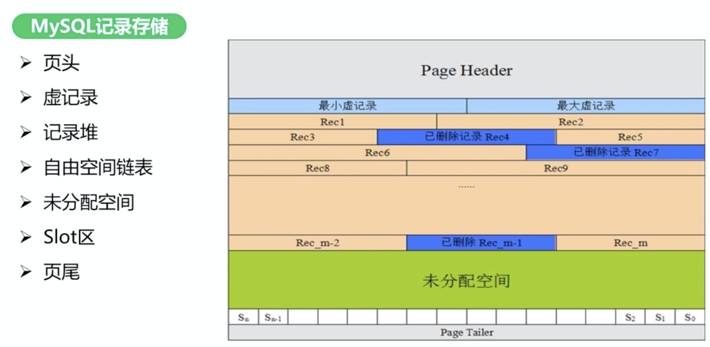

- 页头：记录页面的控制信息，共56字节，包括页的左右兄弟页面指针，页面空间使用情况等。

- 虚记录

  - 最大虚记录：比页内最大主键还大
  - 最小虚记录：比页内最小主键还小

- 记录堆：行记录存储区，分为有效记录和已删除记录两种

- 自由空间链表：被删除记录组成的链表

- 未分配空间：页面未使用的存储空间

- 页尾：页面最后部分，占8个字节，主要存储页面的校验信息


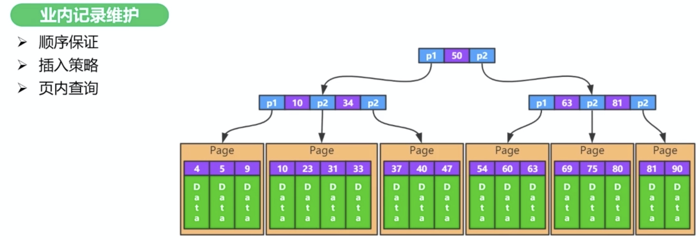

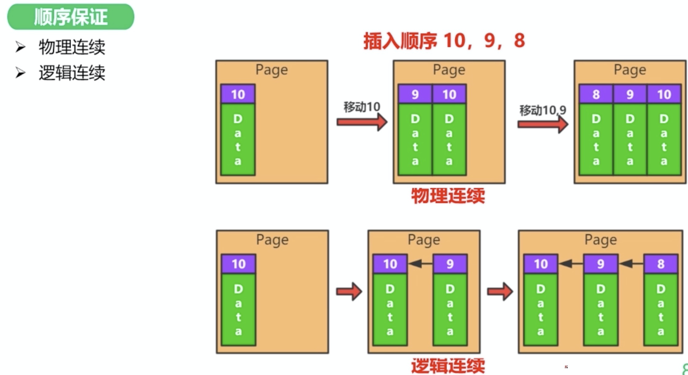

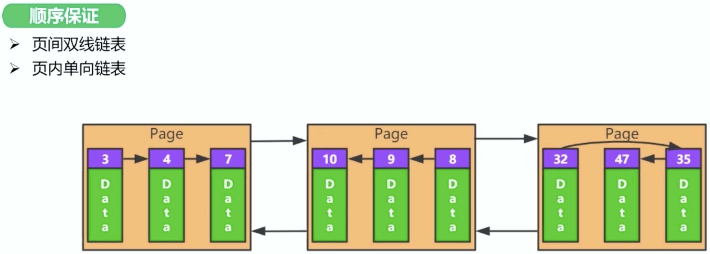


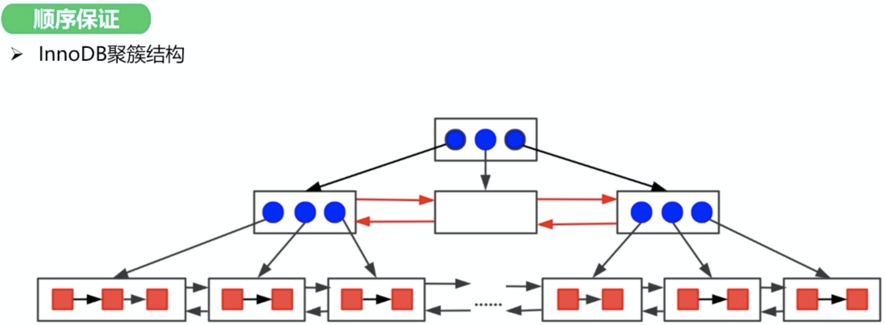


**插入策略**：先插自由空间链表，然后是未使用空间


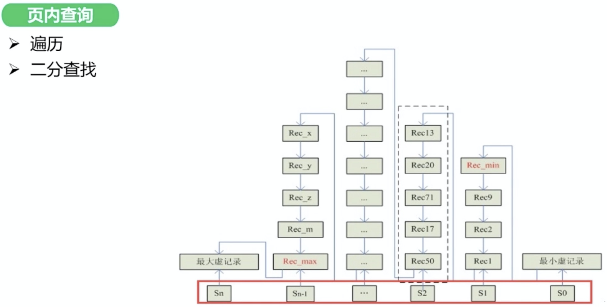


### 2. MySQL InnoDB 索引实现原理及主键设计选择分析

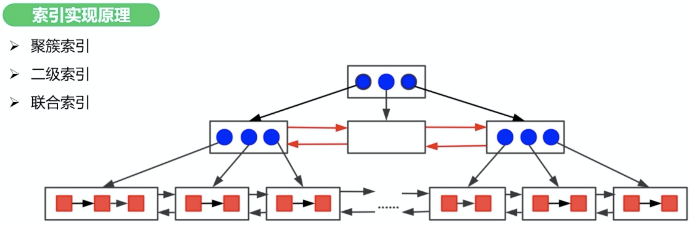


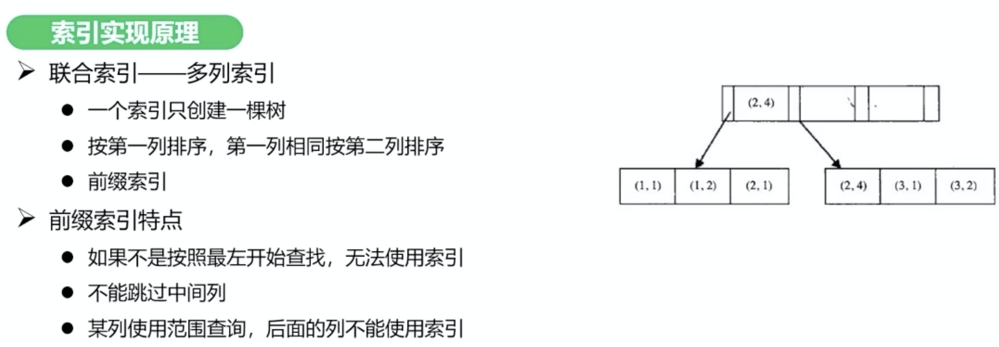


### 3. MySQL InnoDB 存储引擎内存管理

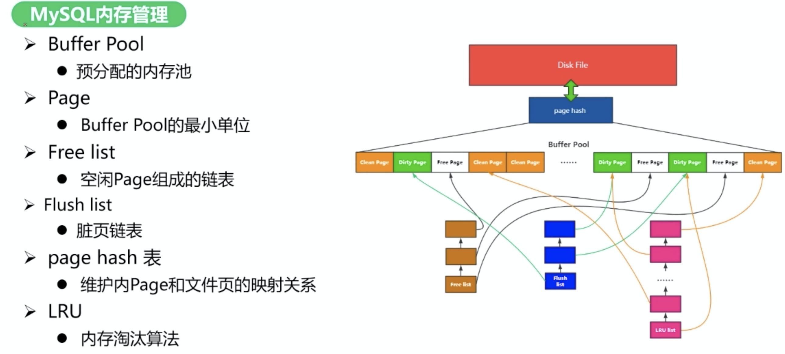


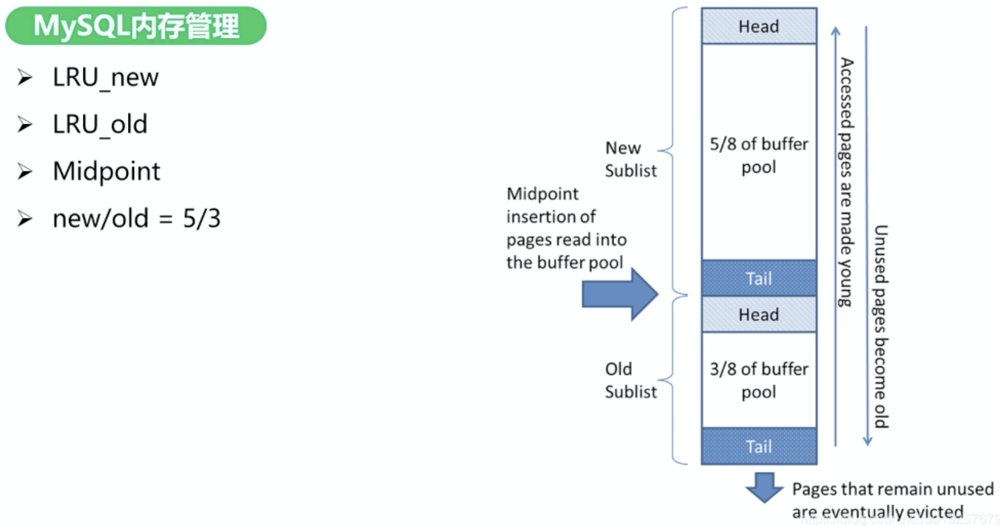


**页面装载（从磁盘加载到内存）优先级：**

1. Free list 中取
2. LRU 中淘汰
3. LRU Flush


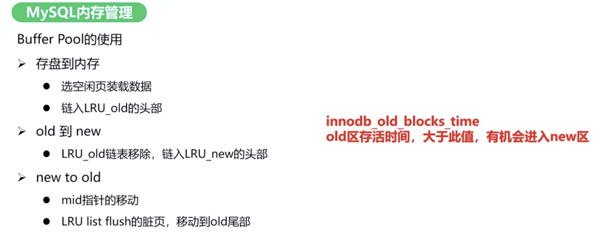


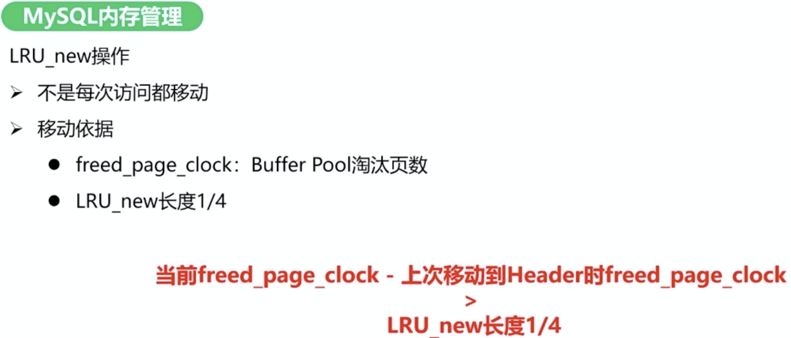


### 4. MySQL InnoDB 事务管理机制原理分析

- 事务特性：ACID

- 并发问题
  - 脏读
  - 不可重复读
  - 幻读

- 隔离级别


MySQL 事务具体实现

- MVCC
- undo log
- redo log

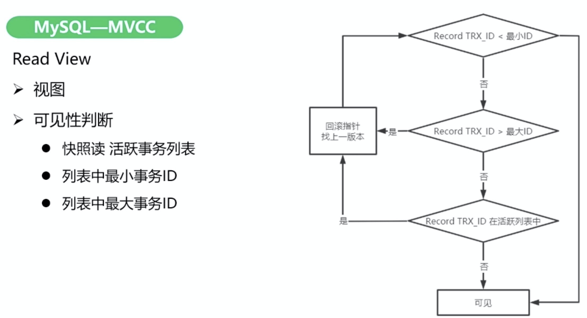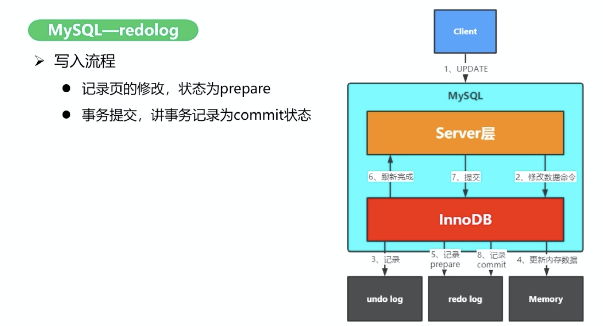


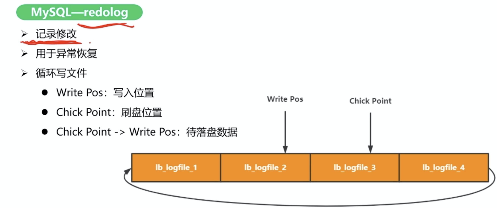


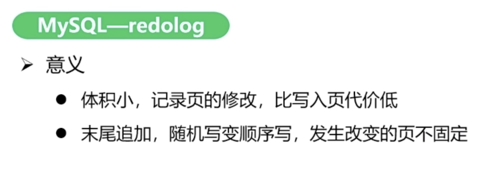

- 支持行锁，采用MVCC来支持高并发 
- 支持事务 
- 支持外键 
- 支持崩溃后的安全恢复 
- 不支持全文索引

是 MySQL 默认的事务型存储引擎，只有在需要它不支持的特性时，才考虑使用其它存储引擎。

实现了四个标准的隔离级别，默认级别是可重复读（REPEATABLE READ）。在可重复读隔离级别下，通过多版本并发控制（MVCC）+ Next-Key Locking 防止幻读。

主索引是聚簇索引，在索引中保存了数据，从而避免直接读取磁盘，因此对查询性能有很大的提升。

内部做了很多优化，包括从磁盘读取数据时采用的可预测性读、能够加快读操作并且自动创建的自适应哈希索引、能够加速插入操作的插入缓冲区等。

支持真正的在线热备份。其它存储引擎不支持在线热备份，要获取一致性视图需要停止对所有表的写入，而在读写混合场景中，停止写入可能也意味着停止读取。


## MyISAM

- 不支持行锁，读取时对需要读到的所有表加锁，写入时则对表加排它锁 
- 不支持事务 
- 不支持外键 
- 不支持崩溃后的安全恢复 
- 在表有读取查询的同时，支持往表中插入新纪录 
- 支持BLOB和TEXT的前500个字符索引，支持全文索引 
- 支持延迟更新索引，极大提升写入性能 
- 对于不会进行修改的表，支持压缩表，极大减少磁盘空间占用

设计简单，数据以紧密格式存储。对于只读数据，或者表比较小、可以容忍修复操作，则依然可以使用它。

提供了大量的特性，包括压缩表、空间数据索引等。

可以手工或者自动执行检查和修复操作，但是和事务恢复以及崩溃恢复不同，可能导致一些数据丢失，而且修复操作是非常慢的。

如果指定了 DELAY_KEY_WRITE 选项，在每次修改执行完成时，不会立即将修改的索引数据写入磁盘，而是会写到内存中的键缓冲区，只有在清理键缓冲区或者关闭表的时候才会将对应的索引块写入磁盘。这种方式可以极大的提升写入性能，但是在数据库或者主机崩溃时会造成索引损坏，需要执行修复操作。


## 比较

总体来讲，MyISAM 适合 SELECT 密集型的表，而 InnoDB 适合 INSERT 和 UPDATE 密集型的表

- 事务：InnoDB 是事务型的，可以使用 Commit 和 Rollback 语句。

- 并发：MyISAM 只支持表级锁，而 InnoDB 还支持行级锁。

- 外键：InnoDB 支持外键。

- 备份：InnoDB 支持在线热备份。

- 崩溃恢复：MyISAM 崩溃后发生损坏的概率比 InnoDB 高很多，而且恢复的速度也更慢。

- 其它特性：MyISAM 支持压缩表和空间数据索引。

  

  

# 八, 拆分

## 垂直分区

**根据数据库里面数据表的相关性进行拆分。** 例如，用户表中既有用户的登录信息又有用户的基本信息，可以将用户表拆分成两个单独的表，甚至放到单独的库做分库。

**简单来说垂直拆分是指数据表列的拆分，把一张列比较多的表拆分为多张表**

- **垂直拆分的优点：** 可以使得列数据变小，在查询时减少读取的Block数，减少I/O次数。此外，垂直分区可以简化表的结构，易于维护。

- **垂直拆分的缺点：** 主键会出现冗余，需要管理冗余列，并会引起Join操作，可以通过在应用层进行Join来解决。此外，垂直分区会让事务变得更加复杂；

  

## 水平分区

**保持数据表结构不变，通过某种策略存储数据分片。这样每一片数据分散到不同的表或者库中，达到了分布式的目的。 水平拆分可以支撑非常大的数据量。**

水平拆分是指数据表行的拆分，表的行数超过200万行时，就会变慢，这时可以把一张的表的数据拆成多张表来存放。举个例子：我们可以将用户信息表拆分成多个用户信息表，这样就可以避免单一表数据量过大对性能造成影响。

水平拆分可以支持非常大的数据量。需要注意的一点是：分表仅仅是解决了单一表数据过大的问题，但由于表的数据还是在同一台机器上，其实对于提升MySQL并发能力没有什么意义，所以 **水平拆分最好分库** 。

水平拆分能够 **支持非常大的数据量存储，应用端改造也少**，但 **分片事务难以解决** ，跨节点Join性能较差，逻辑复杂。《Java工程师修炼之道》的作者推荐 **尽量不要对数据进行分片，因为拆分会带来逻辑、部署、运维的各种复杂度** ，一般的数据表在优化得当的情况下支撑千万以下的数据量是没有太大问题的。如果实在要分片，尽量选择客户端分片架构，这样可以减少一次和中间件的网络I/O。


## 主从复制

主要涉及三个线程：binlog 线程、I/O 线程和 SQL 线程。

- **binlog 线程** ：负责将主服务器上的数据更改写入二进制日志（Binary log）中。
- **I/O 线程** ：负责从主服务器上读取二进制日志，并写入从服务器的中继日志（Relay log）。
- **SQL 线程** ：负责读取中继日志，解析出主服务器已经执行的数据更改并在从服务器中重放（Replay）。

### 读写分离

主服务器处理写操作以及实时性要求比较高的读操作，而从服务器处理读操作。

读写分离能提高性能的原因在于：

- 主从服务器负责各自的读和写，极大程度缓解了锁的争用；
- 从服务器可以使用 MyISAM，提升查询性能以及节约系统开销；
- 增加冗余，提高可用性。

读写分离常用代理方式来实现，代理服务器接收应用层传来的读写请求，然后决定转发到哪个服务器。


# 九.CAP理论

- **C**onsistency: All nodes see the same data at the same time
- **A**vailability: Any client accessing data gets response, even if some nodes are down
- **P**artition-tolerance: The system continues to operate despite network partitions, which implies data replication

A distributed system can guarantee two of these at the same time **but not all three**


例子：

**Hotel Booking**: Two people booking the same room via two different nodes

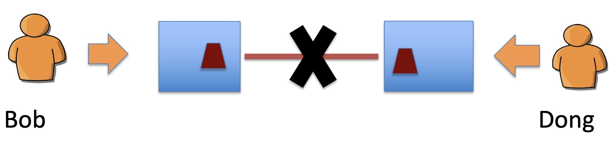

**Hotel Booking**: are we double-booking the same room? Have **A and P but not C.**


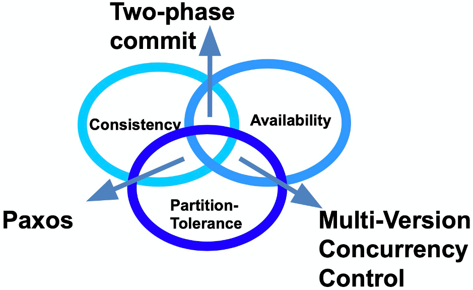

1. **Consistency and Availability: Two phase commit**

   - This is the usual algorithm used in relational DBMS's (and MongoDB, to same extent), it enforces consistency by:

     - locking data that are within the transaction scope
     - performing transactions on write-ahead logs
     - completing transactions (commit) only when all nodes in the cluster have performed the transaction
     - aborts transactions (rollback) when a partition is detected

   - This procedure entails the following:

     - reduced availability (data lock, stop in case of partition)
     - enforced consistency (every database is in a consistent state, and all are left in the same state)

   - Therefore, two-phase commit is a **good solution when the cluster is co-located, less good when it is distributed**

     

2. **Consistency and Partition-Tolerance: Paxos**

   - This family of algorithms is driven by **consensus**, and is both partition-tolerant and consistent
   - In Paxos, every node is either a *proposer* or an *accepter* :
     - a *proposer* proposes a value (with a **timestamp**)
     - an *accepter* can accept or refuse it (e.g. if the *accepter* receives a more recent value)
   - When a proposer has received a sufficient number of acceptances (a ***quorum*** is reached), and a confirmation message is sent to the *accepters* with the agreed value
   - Paxos clusters can **recover from partitions** and maintain consistency, but the smaller part of a partition (the part that is not in the quorum) will not send responses, hence the availability is compromised

   

3. **Availability and Partition-tolerance: Multi-Version Concurrency Control (MVCC)**

   - MVCC is a method to **ensure availability** (every node in a cluster always accepts requests), and some sort of recovery from a partition by reconciling the single databases with *revisions* (data are not replaced, they are just given a new revision number)
   - In MVCC, **concurrent updates are possible without distributed locks** (in *optimistic locking* only the local copy of the object is locked), since the updates will have different revision numbers; the transaction that completes last will get a higher revision number, hence will be considered as the *current value*.
   - In case of cluster partition and concurrent requests with the same revision number going to two partitioned nodes, both are accepted, but once the partition is solved, there would be a *conflict*. Conflict that would have to be solved somehow (CouchDB returns a list of all current conflicts, which are then left to be solved by the application).


## Why this is important?

- The future of databases is **distributed** (Big Data Trend, Face Book, Airline reservations, etc.)
- CAP theorem describes the **trade-offs** involved in distributed systems
- A proper understanding of CAP theorem is essential for **making decisions** about the future of distributed database **design –** what is important – CA, CP or AP


## 一致性分类

提到分布式架构就一定绕不开“一致性”问题，而“一致性”其实又包含了**数据一致性**和**事务一致性**两种情况，本文主要讨论**数据一致性**（事务一致性指ACID）。

**复制**是导致出现**数据一致性**问题的唯一原因。

如果只用一台数据库来处理所有的写入和读取请求，就一定不存在数据一致性的问题。 但在中大型项目中，我们却经常需要将一份数据存储在超过一台数据库中（即**复制**），原因有三：

1、即使一部分数据库出现故障，系统也能正常工作（高可用）

2、使数据与用户在地理上接近（降低延迟）

3、扩展可以处理**读请求**的机器数量（可扩展性、提高读取吞吐量）

本节假设数据集非常小，每台机器的空间都足够保存整个数据集，否则将会引入一个新的话题“分区”。假设使用单领导者的主从复制算法，即**只有一台数据库可以处理写请求**（称为领导者或**主库**），所有数据库都可以处理读请求（除主库外其他都是追随者或**从库**）。

### **强一致性 与 弱一致性**（Strong Consistency && Weak Consistency）

其实只有两类数据一致性，强一致性与弱一致性。强一致性也叫做**线性一致性**，除此以外，所有其他的一致性都是**弱一致性的特殊情况。所谓强一致性，即复制是同步的，弱一致性，即复制是异步的。**

用户更新网站头像，在某个时间点，用户向主库发送更新请求，不久之后主库就收到了请求。在某个时刻，主库又会将数据变更转发给自己的从库。最后，主库通知用户更新成功。

如果在返回“更新成功”并使新头像对其他用户可见之前，主库需要等待从库的确认，确保从库已经收到写入操作，那么复制是同步的，即强一致性。如果主库写入成功后，不等待从库的响应，直接返回“更新成功”，则复制是异步的，即弱一致性。

强一致性可以保证从库有与主库一致的数据。如果主库突然宕机，我们仍可以保证数据完整。但如果从库宕机或网络阻塞，主库就无法完成写入操作。

在实践中，我们通常**使一个从库是同步的，而其他的则是异步的**。如果这个同步的从库出现问题，则使另一个异步从库同步。这可以确保永远有两个节点拥有完整数据：主库和同步从库。 这种配置称为**半同步。**


### **最终一致性**（**Eventual Consistency**）

容忍节点故障只是需要复制的一个原因。另两个原因是可扩展性和降低延迟。

单领导者的主从复制算法要求所有写入都由单个节点处理，但只读查询可以由任何节点处理。对于读多写少的场景，我们往往创建很多从库，并将读请求分散到所有的从库上去。这样能减小主库的负载，并允许向最近的节点发送读请求。当然这只适用于异步复制——如果尝试同步复制，则单个节点故障将使整个系统无法写入。

当用户从**异步从库**读取时，**如果此异步从库落后，他可能会看到过时的信息。**这种不一致只是一个**暂时的状态**——如果等待一段时间，从库最终会赶上并与主库保持一致。这称为**最终一致性。**

**最终**两个字用得很微妙，因为从写入主库到反映至从库之间的延迟，可能仅仅是几分之一秒，也可能是几个小时。

#### **读写一致性**（Read-your-write consistency）

手机刷虎扑的时候经常遇到，回复某人的帖子然后想马上查看，但我刚提交的回复可能尚未到达从库，看起来好像是刚提交的数据丢失了，很不爽。

在这种情况下，我们需要**读写一致性**，也称为**读己之写一致性**。它可以保证，如果用户刷新页面，他们总会看到自己刚提交的任何更新。它不会对其他用户的写入做出承诺，其他用户的更新可能稍等才会看到，但它保证用户自己提交的数据能马上被自己看到。

**如何实现读写一致性？**

最简单的方案，**对于某些特定的内容，都从主库读。**举个例子，知乎个人主页信息只能由用户本人编辑，而不能由其他人编辑。因此，永远从主库读取用户自己的个人主页，从从库读取其他用户的个人主页。

如果应用中的大部分内容都可能被用户编辑，那这种方法就没用了。在这种情况下可以使用其他标准来决定是否从主库读取，例如可以**记录每个用户最后一次写入主库的时间**，一分钟内都从主库读，同时**监控从库的最后同步时间**，任何超过一分钟没有更新的从库不响应查询。

还有一种更好的方法是，客户端可以**在本地记住最近一次写入的时间戳**，发起请求时带着此时间戳。从库提供任何查询服务前，需确保**该时间戳前的变更都已经同步到了本从库中**。如果当前从库不够新，则可以从另一个从库读，或者等待从库追赶上来。

#### 单调读一致性（Monotonic read consistency）

用户从某从库查询到了一条记录，再次刷新后发现此记录不见了，就像遇到**时光倒流**。如果用户从不同从库进行多次读取，就可能发生这种情况。

**单调读**可以保证这种异常不会发生。单调读意味着如果一个用户进行多次读取时，绝对不会遇到时光倒流，即**如果先前读取到较新的数据，后续读取不会得到更旧的数据。**单调读**比强一致性更弱，比最终一致性更强。**

实现单调读取的一种方式是**确保每个用户总是从同一个节点进行读取**（不同的用户可以从不同的节点读取），比如可以基于用户ID的哈希值来选择节点，而不是随机选择节点。

#### **因果一致性**（Causal consistency）

它往往发生在**分区**（也称为**分片**）的分布式数据库中。

分区后，每个节点并不包含全部数据。不同的节点独立运行，因此不存在**全局写入顺序。**如果用户A提交一个问题，用户B提交了回答。问题写入了节点A，回答写入了节点B。因为同步延迟，发起查询的用户可能会先看到回答，再看到问题。

为了防止这种异常，需要另一种类型的保证：**因果一致性**。 即如果一系列写入按某个逻辑顺序发生，那么任何人读取这些写入时，会看见它们以正确的逻辑顺序出现。

这是一个听起来简单，实际却很难解决的问题。一种方案是应用保证将问题和对应的回答写入相同的分区。但并不是所有的数据都能如此轻易地判断因果依赖关系。如果有兴趣可以搜索**向量时钟**深入此问题。


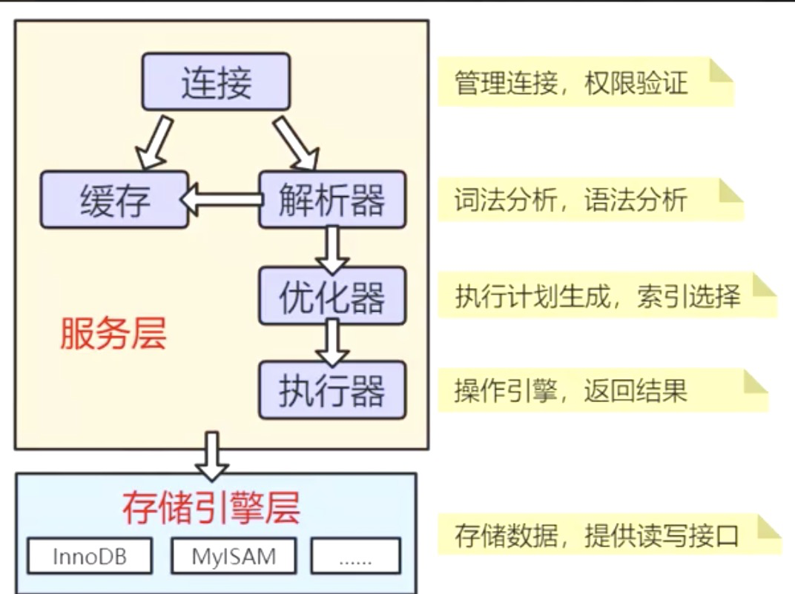

**解析树**

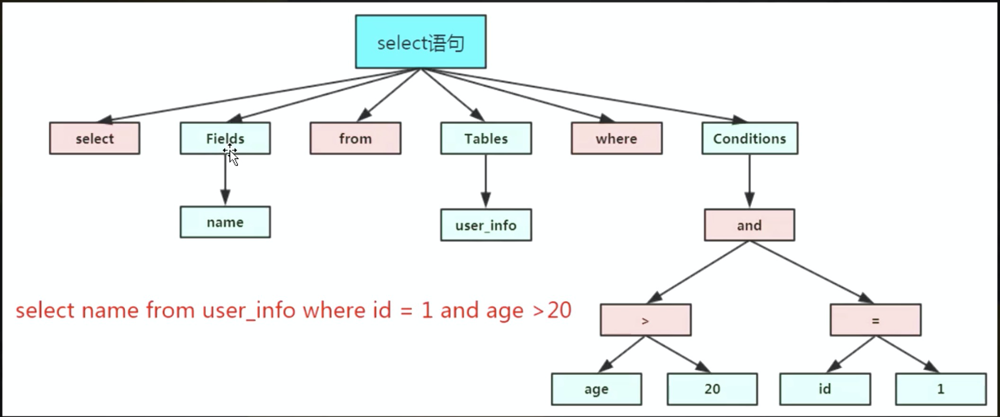

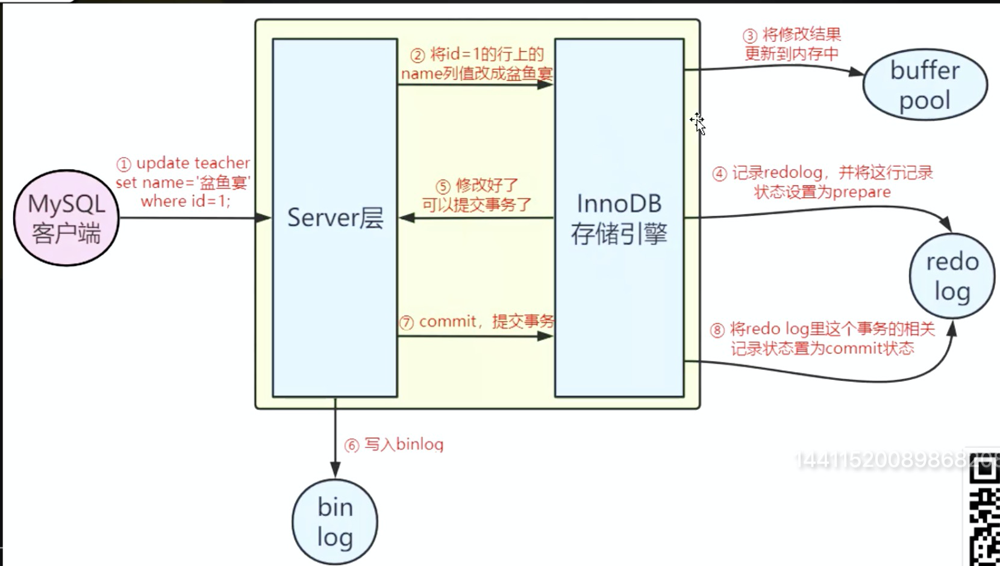